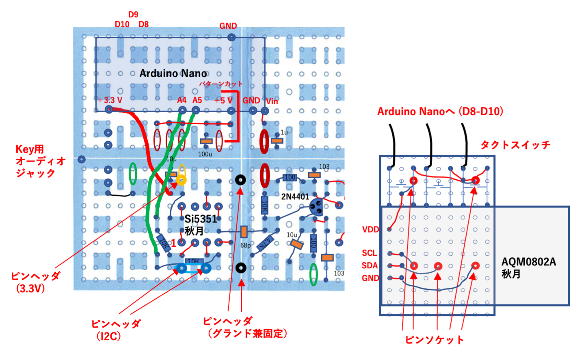

# QP-7C（CRkits共同購入プロジェクト）の改造

 CRkits共同購入プロジェクトで頒布されているQP-7Cミニ送信機（http://jl1kra.sakura.ne.jp/QP-7C.html
 ) の改造を行ました．  

## QP-7Cミニ送信機の改造（その1）

7010kHz以外の周波数での使用と多バンド化対応に向けて改造しました．  
改造は以下の2点です．  
### 1．Si5351モジュールを使用した任意周波数での出力  
	Si5351モジュール（秋月電子）を使用し，発振出力”CLK0”を68pFのコンデンサーを介してドライブ段に入力しました．  
	Si5351は，Arduino Nano互換機からI2Cインターフェースで制御．  
	秋月電子のSi5351モジュールは3.3V駆動なので，本来はI2Cバスの電圧変換(Arduino Nanoは5V)が必要ですが，アマチュア的に電流制限抵抗(10kΩ)の直列接続で使用しました．  
	周波数変更の最も単純なやり方は，Arduinoのプログラムで周波数を固定して発振させる（周波数を変えたいときはプログラムを変える）方法です．  
7010kHz送信出力は，5V(Arduino nanoからの電源供給)で約0.2W， 電源12Vで約2Wでした．  
### 2．多バンド化に向けて，ドライブ段とファイナル段の結合トランスのソケット化およびLPFのソケット化  
	トランス：8ピンICソケットの上にDIY7を乗せてハンダ付け，受け側も8ピンICソケットにします．  
		他のバンド用には、例えばFCZコイル（サトー電気）+共振コンデンサーで大丈夫でしょうか．  
	LPF：8ピン連結ソケットの上に基板を乗せ，その上にLPFを構成しました． 受け側も8ピンICソケットにしました．  
		80m帯、30m帯、20mバンド用のLPFにはCRK-10AやD4Dの回路図などを参考にしてLPFソケット上に作成可能と思われます．  
結合トランスにFCZコイル（9MHz用,サトー電気）+共振コンデンサー(62pF)を用い，CRK-10Aの10MHzモデルのLPFの回路で実験したところ，10110kHzでの送信出力は，5V(Arduino nanoからの電源供給)で約0.2W， 電源12Vで約1Wでした．  

具体的には，図のようにChocolate基板（3x2）上に作製しました．  
  

図中の赤いジャンパー線は基盤の裏側（銅箔側），黒いジャンパー線は部品側で配線です．  
太いジャンパー線(+3.3VとI2Cの配線)は，基盤の裏側で被覆線を使って接続しました．  

Arduino Nano互換機のアナログ端子側(図の下側，+3.3V, +5V, Vin端子のある側)は，Chocolate基板上にピンソケットを付けて，ピンヘッドを付けたArduino Nano互換機と接続します．  
ただし，RSTピンはピンソケットのピンを曲げるか切るかして接続しません（そのまま繋ぐとグランドに接続されてしまう）．  
デジタル端子側(図の上側, D0-D12がある側)はChocolate基板にはピンソケットを付けず，Arduino Nano互換機のピンは空中に浮かしておきます．  
（デジタル端子側のGNDピンだけは，ピンソケットを付けても良い（付けると力学的に安定化します））．  

この図の配置ですと，+5V出力ピンがChocolate基板のグランドに当たってしまうので，図の赤線に沿ってChocolate基板をコの字型にパターンカットしました．  
Arduino Nano互換機の+5V出力を使用しないのであれば，RSTピンと同様にピンソケットのピンを曲げるか切るかして接続しなければOKです．  
Si5351へ電源供給はArduino Nano互換機の+3.3V出力ピンから行います．  
Arduino Nano互換機のUSB端子から電源を受け，+5V出力ピンおよび+3.3V出力ピンへ電源出力しますので，ここからドライブ段とファイナル段への5V供給も可能です．  
Chocolate基板のグランドは全体に繋がっているので，電源の配線は＋側だけでも大丈夫でした．  
DCジャック使用時は，Arduino Nano互換機のVin端子に電源供給します．  
（ブレッドボード用ＤＣジャックＤＩＰ化キットを使って，DCジャックをChocolate基板上に配置しました．）  

Si5351の制御（I2C）にはA4ピン(SDA), A5ピン(SCL)を使用します．  

Si5351モジュール，トランス，LPF用に8ピンICソケットを付けました．  
トランスとLPFをソケット化したので，部品配置がオリジナルとは少し変わっています．  
トランスの8ピンICソケットへの取り付けは写真のようにしました．  
  
電鍵用のジャックも，基板取付用３.５ｍｍステレオミニジャックを使って，Chocolate基板上に配置しました．  

LPFはChocolate基板（1x1）上に作製できます（図を参照）．  
Chocolate基板の中途半端なカットは，カッターナイフで切り込みを入れてからラジオペンチで割れば可能です．  
銅箔側に部品を置かないと，8ピン連結ソケットの半田付けが困難でした．  
（両面ユニバーサル基板なら何の心配もありません．）
#### 最も単純なArduino Nano用スケッチは，”QP-7C_simple.ino”です．  
	"Etherkit SI5351"ライブラリーを使用しました．  
	周波数を変えたいときはプログラム中の”freq”の値を変えます．  
	発振周波数の校正は，無線機で信号を受信しながら行ってください（cal_factorを変えます）．
#### 必要追加部品(2021年10月1日時点の価格)  
	Chocolate基板：CRkits共同購入プロジェクト，380円　http://jl1kra.sakura.ne.jp/chocolate.html  
	Arduino Nano互換機：500円から1,000円程度，オリジナルは高価  
	秋月電子Si5351モジュール：秋月電子，500円　https://akizukidenshi.com/catalog/g/gK-10679/  
	8Pソケット（Si5351モジュール受け、DIY7、DIY7受け、LPFソケット受け）：秋月電子，15円x4　https://akizukidenshi.com/catalog/g/gP-00035/  
	8P連結ソケット（両端オスピン）（LPFソケット用）：秋月電子，55円　https://akizukidenshi.com/catalog/g/gP-00264/  
	ブレッドボード用ＤＣジャックＤＩＰ化キット：秋月電子，100円　https://akizukidenshi.com/catalog/g/gK-05148/  
	基板取付用３．５ｍｍステレオミニジャック：秋月電子，50円　https://akizukidenshi.com/catalog/g/gC-12478/  
	分割ロングピンソケット　１×４２（Arduino Nano受け）：秋月電子，80円　https://akizukidenshi.com/catalog/g/gC-05779/  
	ピンヘッダ　１×４０（必要に応じて）：秋月電子，35円　https://akizukidenshi.com/catalog/g/gC-00167/  
	電解コンデンサ 16V, 100μF（電源用）：2個  
	積層コンデンサ10μF(Si5351電源用）：1個  
	積層コンデンサー1 uF(Nano電源用）：1個  
	抵抗　10kΩ(Si5351モジュールI2C電圧降下用）：2個  
	
### ミニ送信機の改造（その1）の追加  
 秋月電子のI2C接続小型液晶(AQM0802A)を使用して周波数の表示を行い，タクトスイッチで周波数を変えるようにしてみました．  
   
   
	I2C信号の取り出しは，上の図の青色の位置のピンから取りました．  
	LCDとタクトスイッチはユニバーサル基板に乗せ，ピンソケットでChocolate基板と接続しました．  
	Si5351の上に基板が来る形になるので，Si5351をピンソケットタイプにした場合，高さがギリギリになりました．  
	このため，上のピンを切り詰めて，ユニバーサル基板の下に絶縁テープを貼る必要がありました．  
	Chocolate基板には，グランド，3.3V電源，I2C信号用のピンヘッダをつけておきます．  
	(ピンヘッダを長いタイプ（例えば，秋月電子の連結ピンヘッダ6/9/3）にすると高さに余裕がでます．)  
	基板には，タカチ電機工業のスルーホール基板TNF25-35がそのまま使えます．  
	タクトスイッチにはコネクタ付コードをつけておき，Arduino Nano互換機に接続しました(スイッチを押すとグランドに接続)．  
#### Arduino Nano用スケッチ例は，”QP-7C_LCD.ino”です．  
	LCDの表示には”LCD_ST7032"ライブラリーを使用しました．  
	D8ピンを変更する周波数の桁の変更に使用しました．  
	D9ピンを周波数のアップに使用しました．  
	D10ピンを周波数のダウンに使用しました．  
	バンド外の周波数は，強制的に許容バンド内に変更します．  

#### 必要追加部品(2021年10月1日時点の価格)  
	Ｉ２Ｃ接続小型ＬＣＤモジュール（８×２行）ピッチ変換キット：秋月電子，600円　https://akizukidenshi.com/catalog/g/gK-06795/  
	タクトスイッチ：秋月電子，10円x3　https://akizukidenshi.com/catalog/g/gP-03647/  
	コネクタ付コード　４Ｐ：秋月電子，80円 https://akizukidenshi.com/catalog/g/gC-15385/  
	両面ユニバーサル基板：タカチ電工のTNF25-35が便利  
	ピンソケット, ピンヘッダ（）：ミニ送信機の改造（その1）の残り  

## QP-7Cミニ送信機の改造（その2）  
  
QP-7Cミニ送信機の改造（その1）に続いて，デジタルモード(FT8)送信を可能にしました．  
オリジナルは”Ein FT8-QRP-Transceiver” https://www.elektronik-labor.de/HF/FT8QRP.html です．　  
ドイツ語ですが，DeepL翻訳(Google翻訳も可？)を使って読みました．  

### 基本原理は，以下の通りです．  
FT8などのデジタルモードでは，いくつかの周波数を切り替えることで変調しています．  
例えば，FT8では6.25Hz離れた8つの周波数を6.25baud(1秒間に6.25回毎の頻度)で変化させています．  
多くのアマチュア無線送信機では，PCで発生させたオーディオ信号をマイク入力しSSB変調して送信しています．  
一方，”Ein FT8-QRP-Transceiver”では，PCからのオーディオ信号をArduino Nanoで受け，そのオーディオ周波数を測定します．  
次に，Si5351(クロックジェネレーター)を制御し，基準周波数(搬送波)+オーディオ周波数(変調波)の信号(和周波数なのでUSBに対応)を直接発振させ，増幅し，送信します．  
デジタル変調によって，オーディオ変調信号の周波数が変わると，それに追随して，発振周波数を変化させています．  
SSBモードを利用した通常のマイク入力のデジタル変調はAFSK方式ですが，この方式はFSK方式です．  
直接、信号周波数を発振させているので，SSBモードでのAFSK方式で問題となる搬送波の漏れやサイドバンドの漏れは原理的に起こりません．  
一般にデジタルモードの変調速度は遅いので，uSDX(Arduinoと同じCPU(ATmega328P)を使用)での音声SSB発生に比べて処理は簡単です．  
（uSDXの音声SSB発生も，直接Si5351を制御しています．　高速処理が必要ですが基本的にはこの方式と似ています．）  
また、QDX(QRP Labs)の基本原理も，マニュアルを見る限り，同様なようです.   
オリジナルの報告では，実際に通信も出来ているようです.   

QP-7Cミニ送信機の改造（その1）で発振器をSi5351に置換し，Arduino Nanoで制御していますので，そのまま”Ein FT8-QRP-Transceiver”が構築できそうです．  
具体的には，QP-7Cミニ送信機の改造（その1）に以下の追加改造をしました．  
  
### 1．PCからのオーディオ入力用ジャックとオーディオLPFの設置  
	”Ein FT8-QRP-Transceiver”と同じくArduino Nano互換機のD7ピンをオーディオ周波数測定用のコンパレーター入力として使用し、D6ピンを参照用としてグランドに接続しました．  
	オリジナル”Ein FT8-QRP-Transceiver”のオーディオLPFのカットオフ周波数は1.6 kHzですが，もっと高くしても良いと考えました．  
	（回路は同じで、全ての10kΩを4.7kΩ，全ての10nFを4.7nFにすると，カットオフ周波数は7.2 kHzとなります)．  
	オリジナルでは，3.3Vでプルアップしていますが, 5Vにしました（どちらでも大差ないと思います）．  
	また，入力コンデンサーの容量を1uFに増やしました．  
	Arduino Nano互換機の下の基板上に，オーディオ入力用ジャックとオーディオLPFを配置することが可能です（図を参照のこと）．  
	Arduino Nanoのプログラム（スケッチ）はhttps://www.elektronik-labor.de/HF/FT8QRP.html にオリジナル版とCAT control support版(ft8qrp_cat11.ino)があります．  
	元プログラムではオーディオ信号の１サイクルの時間をタイマー計測して周波数を算出しています．  
	記事の中にもあるようにプログラムに少し問題点(500Hz-2000Hzでのみ使用可)があるようなので，若干の修正を加えました．  
	（使用可能周波数範囲が少し狭いですが，オリジナルプログラムも作動します．）　　
	”QP-7C_FT8.ino”でアップロードしました．  
### 2．”QP-7C_FT8.ino”では，CWとデジタルモードの切替も行えるようにしました．  
	電鍵端子をチェックし，Arduino Nano互換機の電源オン時に”押されていない電鍵”が接続されていればCWモード，そうでなければデジタルモードとしました．  
	オーディオジャックの端子をArduino Nano互換機のD2ピンを接続する必要があります.  
	また，ドライブ段の電鍵端子をオーディオジャックに接続する必要があります(オーディオジャックに何も刺さないと，ドライブ段はONになります．)．
#### Arduino Nano用スケッチは”QP-7C_FT8.ino”．  
	電源ON時に電鍵端子がつながっているD2端子がグランドに接続されていればデジタルモード，オープンならCWモードになります．  
	FT8は, 200Hzから3000Hzの範囲で動作しました．  
	オリジナル版（CAT control support版）からの変更点は，主に次の2点です．  
	1. 高周波数領域での測定周波数分解能を上げるために1サイクルではなく, 3サイクルで周波数測定を行いました．  
	2. 低周波数領域で問題になるタイマーのオーバーフローに対応しました．  
	CAT control support版 (ft8qrp_cat11.ino)からTS-2000シミュレート部分もそのまま導入していますので，WSJTーXなどでCAT制御も可能です．  
  
#### 必要追加部品   
	基板取付用３．５ｍｍステレオミニジャック   
	積層コンデンサ1μF(オーディオ入力用）：1個   
	積層コンデンサ4.7nF(オーディオ入力用）：2個   
	抵抗　1MΩ(オーディオ入力用）：1個   
	抵抗　4.7kΩ(オーディオ入力用）：3個(1個はQP-7Cミニ送信機キットの余りを流用可）   

## ミニ送信機の改造（その2）の追加  

”QP-7C_FT8.ino”では，デジタルモード時の送受信切替をSi5351のON/OFFのみで行なっています.  
ドライブ段は常にONのままなので，受信時にもドライブ段にバイアス電流が流れています.  
LTspiceを使用して見積もったところ，12V電源でコレクタ電流が27mA (320mW), 5V電源で7.7mA(39mW)でした.  
受信時にこれはもったいないので，ドライブ段もON/OFFすることにしました.  
また, CWモードでは受信時もSi5351がONのままで局発信号が漏れていますので, そのON/OFFも行うことにしました.  
ちなみにファイナルはC級アンプなので,無信号時に電流はほとんど流れません．　　

#### 方法0：CWモードのみ改良, デジタルモードは従来通り(配線そのまま)
	ミニ送信機の改造（その2）の電鍵の配線では，”KEY”端子につながった電鍵の状態をArduino Nano互換機のD2ピンで検出しています.   
	そのため,CWモードではキーイングに応じて, Si5351の出力をON/OFFするようにプログラミングすることが可能です.  
	しかしこの配線では, デジタルモードでのドライブ段のON/OFFはできません.  
	ON/OFFを行うためには, 電鍵関係の配線を少し変える必要があります(方法1あるいは方法2).  
	配線が前のままでも, 新しいスケッチ”QP-7C_FT8a.ino”は, CWモードでは作動します(キーがオンの時だけSi5351の出力がON).
	デジタルモードでも使用できますが, 配線がそのままですので受信時にもバイアス電流が流れっぱなしです.  

#### 方法1：Arduino Nano互換機のデジタル出力でKEY端子を制御　　
	電鍵端子はD2ピンに接続し、電鍵の状態をArduino Nano互換機で検出します(前と同じ).   
	ドライブ段のON/OFFをArduino Nano互換機のデジタル出力(D12ピン)で制御します.  
	Arduino Nano のデジタル出力の許容電流量は40mAなので，なんとか直接制御できそうです.  
	この場合，D12ピンを制御用に使用して，ドライブ段の”KEY”端子に接続します.  
	(ドライブ段の”KEY”端子は,オーディオジャックの電鍵端子には接続しません.)
	D12ピンを送信時にはLOW (0V), 受信時にはHIGH (5V)とします.  
	ドライブ段のベースバイアス電圧は12V時でも3.8Vなので，エミッターへの5V印加で受信時はトランジスタをOFFにできます.  

#### 方法2：Arduino Nano互換機のデジタル出力でKEY端子をオープンコレクタ接続を使用して制御（標準的かつ堅実な方法）　　
	電鍵端子はD2ピンに接続し、電鍵の状態をArduino Nano互換機で検出します(前と同じ).   
	ドライブ段のON/OFFをArduino Nano互換機のデジタル出力(D13ピン)で制御します.  
	汎用NPNトランジスタ(余っている2N4401など)を使って KEY端子をオープンコレクタ接続で制御します.
	D13ピンを制御用に使用して，送信時にはHIGH (5V), 受信時にはLOW (0V)としています.  
	汎用NPNトランジスタのエミッターをグランドに接続し, コレクタをドライブ段の”KEY”端子に接続します.  
	(ドライブ段の”KEY”端子は,オーディオジャックの電鍵端子には接続しません.)
	ベースとD13ピンを, 抵抗(数kΩ)を介して接続します (余っている1kΩでもOK).  
	送信時には, ベースへの5V印加でNPNトランジスタがONになり,  ”KEY”端子がグランドにつながります.  

#### Arduino Nano用スケッチ例は，”QP-7C_FT8a.ino”です．  
	D2ピンを電鍵入力に使用しました．  
	D12ピンを送受信の切り替えに使用しました（送信時LOW,方法1用)．  
	D13ピンを送受信の切り替えに使用しました（送信時HIGH,方法2用)．  
	方法1もしくは方法2で接続します(実は方法1しか試していません.).
	CW運用時も電鍵で直接”KEY”端子をON/OFFするのではなく, Arduino Nano互換機のデジタル出力ピンを使用して切り替えます(方法0以外).  
	CW運用の受信時にSi5351のCLK0出力をOFFにしましたので,トランシーバー用として使用しやすくなりました.  
	CWモードのままで,電鍵をジャックから抜くと送信します.  
	関連してLCDの表示方法を変更しました(比較的高速な電鍵入力に対応するためです. カーソル桁が点滅します.).  
	 (ちなみにLCDやタクトボタン無しでも, 周波数は読めませんが送信はできます.)

## QP-7Cミニ送信機の改造（その3）   
   
”Ein FT8-QRP-Transceiver” https://www.elektronik-labor.de/HF/FT8QRP.html では受信部もつけてトランシーバー にしています．  
そこで，「QP-7Cミニ送信機の改造（その2）の追加」に続いて，NE602(SA612)を使用してトランシーバー化しました．  
Chocolate基板上の空きスペースに配置しました．  

Simple Mini Receiverキット（CRkits共同購入プロジェクト）をほぼそのまま利用できますが，このキットではグランド接続しないイヤフォン出力を想定しているので，そのままの回路ではPCへの接続ができません．  
このため、D4D(CRkits共同購入プロジェクト)の回路と同様に2N3904のコレクタと電源の間に抵抗(1kΩ程度)を挟んで，コレクタからコンデンサー10uFを通して出力をとり出しました．  
下図のコンデンサー10uFの黄色の楕円部分をオーディオジャックの黄色の楕円部分とつないでいます.  
（ダイナミックイヤフォンを接続した場合，音量が少し小さいです．）  
（CA3028 Rxキット（CRkits共同購入プロジェクト）を使えばオーディオアンプが付いているので，スピーカーでも大丈夫でしょう．)  
Si5351のCLK1出力を68pFのコンデンサーを介してSA612の6番ピンに入力しました（水晶発振子は使用しない）．  
QP-7Cミニ送信機の改造で余ったDIY7を使用しました（多バンド対応のためソケット化しました）．  
将来的にRFプリアンプも追加できるようにソケットに5V電源を供給可能としました（必要無いかも知れません）．  
入力段のフィルターX’talと同調用直列Cは差替え可能にするため，ソケット化しました（使用しない場合は，ジャンパー接続します）．  

送受切替は，リレー切替がベストと思われますが，受信側の入力インピーダンスを高くして直結する(CRK-10Aなどの方式)のもありそうです．  
今回、QP-7Cミニ送信機の改造で余ったDIY7を受信機に使いたいのと，QP-7C送信機に後付けで受信部を付けたという理由から，
送信時に受信部をアンテナ回路から切断し，受信時だけ接続するMOSFETスイッチ(QCX(QRP Labs）などの）方式にしました．  
汎用MOSFET（BS170）を使用したON/OFFスイッチで，MOSFETスイッチの制御はArduino Nanoから行いました（D11ピン）．  
アンテナからの受信信号はLPFを通ったあと, 1nFのコンデンサを介してNch-MOSFET (BS170) のドレインに印加されます.  
Nch-MOSFET (BS170) のソースから出た信号は10nFのコンデンサを介して, 入力トランス(DIY7)に接続されます.   
ゲートにスイッチング電圧を印加できるように, ソースは1kΩの抵抗でグランドに接続されています(QCXと同じ）.  
ゲートには, D11ピンからのオンオフ信号が印加されます (5V印加でON, ドレイン-ソース間が接続.).  

ドライブ段などの送受信の切り替え制御は「ミニ送信機の改造（その2）の追加」をご参照ください．  

これらをChocolate基板上に配置したのが下図です．  
  

#### Arduino Nano用スケッチは"QP-7C_TRX.ino"です．  
	D2ピンを電鍵入力に使用しています．  
	D11ピンを送受信の受信アンテナ回路の接続/切断（受信時HIGH, 送信時LOW）に使用しています
	D12ピンを送受信のドライブ段のON/OFF（受信時HIGH, 送信時LOW）に使用しています．  
	D13ピンを送受信の切り替え（受信時LOW, 送信時HIGH）に使用しています (現在, 未使用)．  
	このプログラムは,受信部無し, LCD無しでも使用できます.  
  
#### 必要追加部品(2021年10月1日時点の価格)  
	Simple Mini Receiverキット：CRkits共同購入プロジェクト，1020円　http://jl1kra.sakura.ne.jp/SimpleRX.html  
	8Pソケット（DIY7ソケット用）：秋月電子，15円x2　https://akizukidenshi.com/catalog/g/gP-00035/  
	基板取付用３．５ｍｍステレオミニジャック：秋月電子，50円　https://akizukidenshi.com/catalog/g/gC-12478/  
	1N4148(Rx入力保護用)：秋月電子，100円(50本入, 2本のみ使用）　https://akizukidenshi.com/catalog/g/gI-00941/  
	BS170(Tx-Rx切替用)：秋月電子，20円 https://akizukidenshi.com/catalog/g/gI-09724/  
	丸ピンＩＣ用ソケット（X’tal, C差替え用）：秋月電子,150円　https://akizukidenshi.com/catalog/g/gP-01591/  
	コネクタ付コード　４Ｐ　（赤黒黄緑)：秋月電子，80円 https://akizukidenshi.com/catalog/g/gC-15385/  
	コンデンサ10μF(オーディオ出力用）：1個  
	コンデンサ1μF（DIY7ソケット電源用）：必要なら1個 (Simple Mini Receiverキットの余りを流用可）
	コンデンサ0.1μF（Tx-Rx切替用）：1個  
	コンデンサ102（Tx-Rx切替用）：1個  
	コンデンサ103（Tx-Rx切替用）：1個(QP-7Cミニ送信機キットの余りを流用可）  
	抵抗　1kΩ(オーディオ出力用）：1個 (QP-7Cミニ送信機キットの余りを流用可）  
	抵抗　1kΩ(Tx-Rx切替用）：1個 (QP-7Cミニ送信機キットの余りを流用可）  
