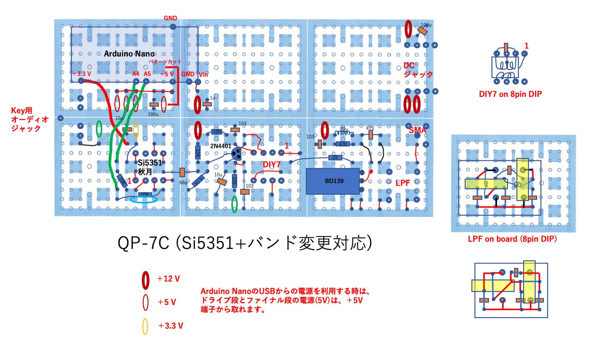
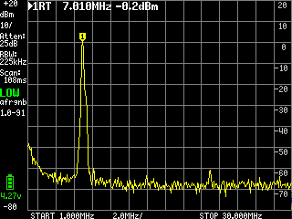

# QP-7C（CRkits共同購入プロジェクト）の改造

 CRkits共同購入プロジェクトで頒布されているQP-7Cミニ送信機（http://jl1kra.sakura.ne.jp/QP-7C.html
 ) の改造を行ました．  

## QP-7Cミニ送信機の改造（その1）

7010kHz以外の周波数での使用と多バンド化対応に向けて改造しました．  
改造は以下の2点です．  
### 1．Si5351モジュールを使用した任意周波数での出力  
	Si5351モジュール（秋月電子）を使用し，発振出力”CLK0”を68pFのコンデンサーを介してドライブ段に入力しました．  
	Si5351は，Arduino Nano互換機からI2Cインターフェースで制御．  
	秋月電子のSi5351モジュールは3.3V駆動なので，本来はI2Cバスの電圧変換(Arduino Nanoは5V)が必要ですが，アマチュア的に電流制限抵抗(10kΩ)の直列接続で使用しました．  
	周波数変更の最も単純なやり方は，Arduinoのプログラムで周波数を固定して発振させる（周波数を変えたいときはプログラムを変える）方法です．  
7010kHz送信出力は，5V(Arduino nanoからの電源供給)で約0.2W， 電源12Vで約2Wでした．  
### 2．多バンド化に向けて，ドライブ段とファイナル段の結合トランスのソケット化およびLPFのソケット化  
	トランス：8ピンICソケットの上にDIY7を乗せてハンダ付け，受け側も8ピンICソケットにします．  
		他のバンド用には、例えばFCZコイル（サトー電気）+共振コンデンサーで大丈夫でしょうか．  
	LPF：8ピン連結ソケットの上に基板を乗せ，その上にLPFを構成しました． 受け側も8ピンICソケットにしました．  
		80m帯、30m帯、20mバンド用のLPFにはCRK-10AやD4Dの回路図などを参考にしてLPFソケット上に作成可能と思われます．  
結合トランスにFCZコイル（9MHz用,サトー電気）+共振コンデンサー(62pF)を用い，CRK-10Aの10MHzモデルのLPFの回路で実験したところ，10110kHzでの送信出力は，5V(Arduino nanoからの電源供給)で約0.2W， 電源12Vで約1Wでした．  

具体的には，図のようにChocolate基板（3x2）上に作製しました．  
  

図中の赤いジャンパー線は基盤の裏側（銅箔側），黒いジャンパー線は部品側で配線です．  
太いジャンパー線(+3.3VとI2Cの配線)は，基盤の裏側で被覆線を使って接続しました．  

Arduino Nano互換機のアナログ端子側(図の下側，+3.3V, +5V, Vin端子のある側)は，Chocolate基板上にピンソケットを付けて，ピンヘッドを付けたArduino Nano互換機と接続します．  
ただし，RSTピンはピンソケットのピンを曲げるか切るかして接続しません（そのまま繋ぐとグランドに接続されてしまう）．  
デジタル端子側(図の上側, D0-D12がある側)はChocolate基板にはピンソケットを付けず，Arduino Nano互換機のピンは空中に浮かしておきます．  
（デジタル端子側のGNDピンだけは，ピンソケットを付けても良い（付けると力学的に安定化します））．  

この図の配置ですと，+5V出力ピンがChocolate基板のグランドに当たってしまうので，図の赤線に沿ってChocolate基板をコの字型にパターンカットしました．  
Arduino Nano互換機の+5V出力を使用しないのであれば，RSTピンと同様にピンソケットのピンを曲げるか切るかして接続しなければOKです．  
Si5351へ電源供給はArduino Nano互換機の+3.3V出力ピンから行います．  
Arduino Nano互換機のUSB端子から電源を受け，+5V出力ピンおよび+3.3V出力ピンへ電源出力しますので，ここからドライブ段とファイナル段への5V供給も可能です．  
Chocolate基板のグランドは全体に繋がっているので，電源の配線は＋側だけでも大丈夫でした．  
DCジャック使用時は，Arduino Nano互換機のVin端子に電源供給します．  
（ブレッドボード用ＤＣジャックＤＩＰ化キットを使って，DCジャックをChocolate基板上に配置しました．）  

Si5351の制御（I2C）にはA4ピン(SDA), A5ピン(SCL)を使用します．  

Si5351モジュール，トランス，LPF用に8ピンICソケットを付けました．  
トランスとLPFをソケット化したので，部品配置がオリジナルとは少し変わっています．  
トランスの8ピンICソケットへの取り付けは写真のようにしました．  
  
電鍵用のジャックも，基板取付用３.５ｍｍステレオミニジャックを使って，Chocolate基板上に配置しました．  

LPFはChocolate基板（1x1）上に作製できます（図を参照）．  
Chocolate基板の中途半端なカットは，カッターナイフで切り込みを入れてからラジオペンチで割れば可能です．  
銅箔側に部品を置かないと，8ピン連結ソケットの半田付けが困難でした．  
（両面ユニバーサル基板なら何の心配もありません．）
#### 最も単純なArduino Nano用スケッチは，”QP-7C_simple.ino”です．  
	"Etherkit SI5351"ライブラリーを使用しました．  
	周波数を変えたいときはプログラム中の”freq”の値を変えます．  
	発振周波数の校正は，無線機で信号を受信しながら行ってください（cal_factorを変えます）．
#### 必要追加部品(2021年10月1日時点の価格)  
	Chocolate基板：CRkits共同購入プロジェクト，380円　http://jl1kra.sakura.ne.jp/chocolate.html  
	Arduino Nano互換機：500円から1,000円程度，オリジナルは高価  
	秋月電子Si5351モジュール：秋月電子，500円　https://akizukidenshi.com/catalog/g/gK-10679/  
	8Pソケット（Si5351モジュール受け、DIY7、DIY7受け、LPFソケット受け）：秋月電子，15円x4　https://akizukidenshi.com/catalog/g/gP-00035/  
	8P連結ソケット（両端オスピン）（LPFソケット用）：秋月電子，55円　https://akizukidenshi.com/catalog/g/gP-00264/  
	ブレッドボード用ＤＣジャックＤＩＰ化キット：秋月電子，100円　https://akizukidenshi.com/catalog/g/gK-05148/  
	基板取付用３．５ｍｍステレオミニジャック：秋月電子，50円　https://akizukidenshi.com/catalog/g/gC-12478/  
	分割ロングピンソケット　１×４２（Arduino Nano受け）：秋月電子，80円　https://akizukidenshi.com/catalog/g/gC-05779/  
	ピンヘッダ　１×４０（必要に応じて）：秋月電子，35円　https://akizukidenshi.com/catalog/g/gC-00167/  
	電解コンデンサ 16V, 100μF（電源用）：2個  
	積層コンデンサ10μF(Si5351電源用）：1個  
	積層コンデンサー1 uF(Nano電源用）：1個  
	抵抗　10kΩ(Si5351モジュールI2C電圧降下用）：2個  
	
### ミニ送信機の改造（その1）の追加  
 秋月電子のI2C接続小型液晶(AQM0802A)を使用して周波数の表示を行い，タクトスイッチで周波数を変えるようにしてみました．  
   
   
	I2C信号の取り出しは，上の図の青色の位置のピンから取りました．  
	LCDとタクトスイッチはユニバーサル基板に乗せ，ピンソケットでChocolate基板と接続しました．  
	Si5351の上に基板が来る形になるので，Si5351をピンソケットタイプにした場合，高さがギリギリになりました．  
	このため，上のピンを切り詰めて，ユニバーサル基板の下に絶縁テープを貼る必要がありました．  
	Chocolate基板には，グランド，3.3V電源，I2C信号用のピンヘッダをつけておきます．  
	(ピンヘッダを長いタイプ（例えば，秋月電子の連結ピンヘッダ6/9/3）にすると高さに余裕がでます．)  
	基板には，タカチ電機工業のスルーホール基板TNF25-35がそのまま使えます．  
	タクトスイッチにはコネクタ付コードをつけておき，Arduino Nano互換機に接続しました(スイッチを押すとグランドに接続)．  
#### Arduino Nano用スケッチ例は，”QP-7C_LCD.ino”です．  
	LCDの表示には”LCD_ST7032"ライブラリーを使用しました．  
	D8ピンを変更する周波数の桁の変更に使用しました．  
	D9ピンを周波数のアップに使用しました．  
	D10ピンを周波数のダウンに使用しました．  
	バンド外の周波数は，強制的に許容バンド内に変更します．  

#### 必要追加部品(2021年10月1日時点の価格)  
	Ｉ２Ｃ接続小型ＬＣＤモジュール（８×２行）ピッチ変換キット：秋月電子，600円　https://akizukidenshi.com/catalog/g/gK-06795/  
	タクトスイッチ：秋月電子，10円x3　https://akizukidenshi.com/catalog/g/gP-03647/  
	コネクタ付コード　４Ｐ：秋月電子，80円 https://akizukidenshi.com/catalog/g/gC-15385/  
	両面ユニバーサル基板：タカチ電工のTNF25-35が便利  
	ピンソケット, ピンヘッダ（）：ミニ送信機の改造（その1）の残り  

## QP-7Cミニ送信機の改造（その2）  
  
QP-7Cミニ送信機の改造（その1）に続いて，デジタルモード(FT8)送信を可能にしました．  
オリジナルは”Ein FT8-QRP-Transceiver” https://www.elektronik-labor.de/HF/FT8QRP.html です．　  
ドイツ語ですが，DeepL翻訳(Google翻訳も可？)を使って読みました．  

### 基本原理は，以下の通りです．  
FT8などのデジタルモードでは，いくつかの周波数を切り替えることで変調しています．  
例えば，FT8では6.25Hz離れた8つの周波数を6.25baud(1秒間に6.25回毎の頻度)で変化させています．  
多くのアマチュア無線送信機では，PCで発生させたオーディオ信号をマイク入力しSSB変調して送信しています．  
一方，”Ein FT8-QRP-Transceiver”では，PCからのオーディオ信号をArduino Nanoで受け，そのオーディオ周波数を測定します．  
次に，Si5351(クロックジェネレーター)を制御し，基準周波数(搬送波)+オーディオ周波数(変調波)の信号(和周波数なのでUSBに対応)を直接発振させ，増幅し，送信します．  
デジタル変調によって，オーディオ変調信号の周波数が変わると，それに追随して，発振周波数を変化させています．  
SSBモードを利用した通常のマイク入力のデジタル変調はAFSK方式ですが，この方式はFSK方式です．  
直接、信号周波数を発振させているので，SSBモードでのAFSK方式で問題となる搬送波の漏れやサイドバンドの漏れは原理的に起こりません．  
一般にデジタルモードの変調速度は遅いので，uSDX(Arduinoと同じCPU(ATmega328P)を使用)での音声SSB発生に比べて処理は簡単です．  
（uSDXの音声SSB発生も，直接Si5351を制御しています．　高速処理が必要ですが基本的にはこの方式と似ています．）  
また、QDX(QRP Labs)の基本原理も，マニュアルを見る限り，同様なようです.   
オリジナルの報告では，実際に通信も出来ているようです.   

QP-7Cミニ送信機の改造（その1）で発振器をSi5351に置換し，Arduino Nanoで制御していますので，そのまま”Ein FT8-QRP-Transceiver”が構築できそうです．  
具体的には，QP-7Cミニ送信機の改造（その1）に以下の追加改造をしました．  
  
### 1．PCからのオーディオ入力用ジャックとオーディオLPFの設置  
	”Ein FT8-QRP-Transceiver”と同じくArduino Nano互換機のD7ピンをオーディオ周波数測定用のコンパレーター入力として使用し、D6ピンを参照用としてグランドに接続しました．  
	オリジナル”Ein FT8-QRP-Transceiver”のオーディオLPFのカットオフ周波数は1.6 kHzですが，もっと高くしても良いと考えました．  
	（回路は同じで、全ての10kΩを4.7kΩ，全ての10nFを4.7nFにすると，カットオフ周波数は7.2 kHzとなります)．  
	オリジナルでは，3.3Vでプルアップしていますが, 5Vにしました（どちらでも大差ないと思います）．  
	また，入力コンデンサーの容量を1uFに増やしました．  
	Arduino Nano互換機の下の基板上に，オーディオ入力用ジャックとオーディオLPFを配置することが可能です（図を参照のこと）．  
	Arduino Nanoのプログラム（スケッチ）はhttps://www.elektronik-labor.de/HF/FT8QRP.html にオリジナル版とCAT control support版(ft8qrp_cat11.ino)があります．  
	元プログラムではオーディオ信号の１サイクルの時間をタイマー計測して周波数を算出しています．  
	記事の中にもあるようにプログラムに少し問題点(500Hz-2000Hzでのみ使用可)があるようなので，若干の修正を加えました．  
	（使用可能周波数範囲が少し狭いですが，オリジナルプログラムも作動します．）　　
	”QP-7C_FT8.ino”でアップロードしました．  
### 2．”QP-7C_FT8.ino”では，CWとデジタルモードの切替も行えるようにしました．  
	電鍵端子をチェックし，Arduino Nano互換機の電源オン時に”押されていない電鍵”が接続されていればCWモード，そうでなければデジタルモードとしました．  
	オーディオジャックの端子をArduino Nano互換機のD2ピンを接続する必要があります.  
	また，ドライブ段の電鍵端子をオーディオジャックに接続する必要があります(オーディオジャックに何も刺さないと，ドライブ段はONになります．)．
#### Arduino Nano用スケッチは”QP-7C_FT8.ino”．  
	電源ON時に電鍵端子がつながっているD2端子がグランドに接続されていればデジタルモード，オープンならCWモードになります．  
	FT8は, 200Hzから3000Hzの範囲で動作しました．  
	オリジナル版（CAT control support版）からの変更点は，主に次の2点です．  
	1. 高周波数領域での測定周波数分解能を上げるために1サイクルではなく, 3サイクルで周波数測定を行いました．  
	2. 低周波数領域で問題になるタイマーのオーバーフローに対応しました．  
	CAT control support版 (ft8qrp_cat11.ino)からTS-2000シミュレート部分もそのまま導入していますので，WSJTーXなどでCAT制御も可能です．  
  
#### 必要追加部品   
	基板取付用３．５ｍｍステレオミニジャック   
	積層コンデンサ1μF(オーディオ入力用）：1個   
	積層コンデンサ4.7nF(オーディオ入力用）：2個   
	抵抗　1MΩ(オーディオ入力用）：1個   
	抵抗　4.7kΩ(オーディオ入力用）：3個(1個はQP-7Cミニ送信機キットの余りを流用可）   

## ミニ送信機の改造（その2）の追加  

”QP-7C_FT8.ino”では，デジタルモード時の送受信切替をSi5351のON/OFFのみで行なっています.  
ドライブ段は常にONのままなので，受信時にもドライブ段にバイアス電流が流れています.  
LTspiceを使用して見積もったところ，12V電源でコレクタ電流が27mA (320mW), 5V電源で7.7mA(39mW)でした.  
受信時にこれはもったいないので，ドライブ段もON/OFFすることにしました.  
また, CWモードでは受信時もSi5351がONのままで局発信号が漏れていますので, そのON/OFFも行うことにしました.  
ちなみにファイナルはC級アンプなので,無信号時に電流はほとんど流れません．　　

#### 方法0：CWモードのみ改良, デジタルモードは従来通り(配線そのまま)
	ミニ送信機の改造（その2）の電鍵の配線では，”KEY”端子につながった電鍵の状態をArduino Nano互換機のD2ピンで検出しています.   
	そのため,CWモードではキーイングに応じて, Si5351の出力をON/OFFするようにプログラミングすることが可能です.  
	しかしこの配線では, デジタルモードでのドライブ段のON/OFFはできません.  
	ON/OFFを行うためには, 電鍵関係の配線を少し変える必要があります(方法1あるいは方法2).  
	配線が前のままでも, 新しいスケッチ”QP-7C_FT8a.ino”は, CWモードでは作動します(キーがオンの時だけSi5351の出力がON).
	デジタルモードでも使用できますが, 配線がそのままですので受信時にもバイアス電流が流れっぱなしです.  

#### 方法1：Arduino Nano互換機のデジタル出力でKEY端子を制御　　
	電鍵端子はD2ピンに接続し、電鍵の状態をArduino Nano互換機で検出します(前と同じ).   
	ドライブ段のON/OFFをArduino Nano互換機のデジタル出力(D12ピン)で制御します.  
	Arduino Nano のデジタル出力の許容電流量は40mAなので，なんとか直接制御できそうです.  
	この場合，D12ピンを制御用に使用して，ドライブ段の”KEY”端子に接続します.  
	(ドライブ段の”KEY”端子は,オーディオジャックの電鍵端子には接続しません.)
	D12ピンを送信時にはLOW (0V), 受信時にはHIGH (5V)とします.  
	ドライブ段のベースバイアス電圧は12V時でも3.8Vなので，エミッターへの5V印加で受信時はトランジスタをOFFにできます.  

#### 方法2：Arduino Nano互換機のデジタル出力でKEY端子をオープンコレクタ接続を使用して制御（標準的かつ堅実な方法）　　
	電鍵端子はD2ピンに接続し、電鍵の状態をArduino Nano互換機で検出します(前と同じ).   
	ドライブ段のON/OFFをArduino Nano互換機のデジタル出力(D13ピン)で制御します.  
	汎用NPNトランジスタ(余っている2N4401など)を使って KEY端子をオープンコレクタ接続で制御します.
	D13ピンを制御用に使用して，送信時にはHIGH (5V), 受信時にはLOW (0V)としています.  
	汎用NPNトランジスタのエミッターをグランドに接続し, コレクタをドライブ段の”KEY”端子に接続します.  
	(ドライブ段の”KEY”端子は,オーディオジャックの電鍵端子には接続しません.)
	ベースとD13ピンを, 抵抗(数kΩ)を介して接続します (余っている1kΩでもOK).  
	送信時には, ベースへの5V印加でNPNトランジスタがONになり,  ”KEY”端子がグランドにつながります.  

#### Arduino Nano用スケッチ例は，”QP-7C_FT8a.ino”です．  
	D2ピンを電鍵入力に使用しました．  
	D12ピンを送受信の切り替えに使用しました（送信時LOW,方法1用)．  
	D13ピンを送受信の切り替えに使用しました（送信時HIGH,方法2用)．  
	方法1もしくは方法2で接続します(実は方法1しか試していません.).
	CW運用時も電鍵で直接”KEY”端子をON/OFFするのではなく, Arduino Nano互換機のデジタル出力ピンを使用して切り替えます(方法0以外).  
	CW運用の受信時にSi5351のCLK0出力をOFFにしましたので,トランシーバー用として使用しやすくなりました.  
	CWモードのままで,電鍵をジャックから抜くと送信します.  
	関連してLCDの表示方法を変更しました(比較的高速な電鍵入力に対応するためです. カーソル桁が点滅します.).  
	 (ちなみにLCDやタクトボタン無しでも, 周波数は読めませんが送信はできます.)

## QP-7Cミニ送信機の改造（その3）   
   
”Ein FT8-QRP-Transceiver” https://www.elektronik-labor.de/HF/FT8QRP.html では受信部もつけてトランシーバー にしています．  
そこで，「QP-7Cミニ送信機の改造（その2）の追加」に続いて，NE602(SA612)を使用してトランシーバー化しました．  
Chocolate基板上の空きスペースに配置しました．  

Simple Mini Receiverキット（CRkits共同購入プロジェクト）をほぼそのまま利用できますが，このキットではグランド接続しないイヤフォン出力を想定しているので，そのままの回路ではPCへの接続ができません．  
このため、D4D(CRkits共同購入プロジェクト)の回路と同様に2N3904のコレクタと電源の間に抵抗(1kΩ程度)を挟んで，コレクタからコンデンサー10uFを通して出力をとり出しました．  
下図のコンデンサー10uFの黄色の楕円部分をオーディオジャックの黄色の楕円部分とつないでいます.  
（ダイナミックイヤフォンを接続した場合，音量が少し小さいです．）  
（CA3028 Rxキット（CRkits共同購入プロジェクト）を使えばオーディオアンプが付いているので，スピーカーでも大丈夫でしょう．)  
Si5351のCLK1出力を68pFのコンデンサーを介してSA612の6番ピンに入力しました（水晶発振子は使用しない）．  
QP-7Cミニ送信機の改造で余ったDIY7を使用しました（多バンド対応のためソケット化しました）．  
将来的にRFプリアンプも追加できるようにソケットに5V電源を供給可能としました（必要無いかも知れません）．  
入力段のフィルターX’talと同調用直列Cは差替え可能にするため，ソケット化しました（使用しない場合は，ジャンパー接続します）．  

送受切替は，リレー切替がベストと思われますが，受信側の入力インピーダンスを高くして直結する(CRK-10Aなどの方式)のもありそうです．  
今回、QP-7Cミニ送信機の改造で余ったDIY7を受信機に使いたいのと，QP-7C送信機に後付けで受信部を付けたという理由から，
送信時に受信部をアンテナ回路から切断し，受信時だけ接続するMOSFETスイッチ(QCX(QRP Labs）などの）方式にしました．  
汎用MOSFET（BS170）を使用したON/OFFスイッチで，MOSFETスイッチの制御はArduino Nanoから行いました（D11ピン）．  
アンテナからの受信信号はLPFを通ったあと, 1nFのコンデンサを介してNch-MOSFET (BS170) のドレインに印加されます.  
Nch-MOSFET (BS170) のソースから出た信号は10nFのコンデンサを介して, 入力トランス(DIY7)に接続されます.   
ゲートにスイッチング電圧を印加できるように, ソースは1kΩの抵抗でグランドに接続されています(QCXと同じ）.  
ゲートには, D11ピンからのオンオフ信号が印加されます (5V印加でON, ドレイン-ソース間が接続.).  

ドライブ段などの送受信の切り替え制御は「ミニ送信機の改造（その2）の追加」をご参照ください．  

これらをChocolate基板上に配置したのが下図です．  
  

#### Arduino Nano用スケッチは"QP-7C_TRX.ino"です．  
	D2ピンを電鍵入力に使用しています．  
	D11ピンを送受信の受信アンテナ回路の接続/切断（受信時HIGH, 送信時LOW）に使用しています
	D12ピンを送受信のドライブ段のON/OFF（受信時HIGH, 送信時LOW）に使用しています．  
	D13ピンを送受信の切り替え（受信時LOW, 送信時HIGH）に使用しています (現在, 未使用)．  
	このプログラムは,受信部無し, LCD無しでも使用できます.  
  
#### 必要追加部品(2021年10月1日時点の価格)  
	Simple Mini Receiverキット：CRkits共同購入プロジェクト，1020円　http://jl1kra.sakura.ne.jp/SimpleRX.html  
	8Pソケット（DIY7ソケット用）：秋月電子，15円x2　https://akizukidenshi.com/catalog/g/gP-00035/  
	基板取付用３．５ｍｍステレオミニジャック：秋月電子，50円　https://akizukidenshi.com/catalog/g/gC-12478/  
	1N4148(Rx入力保護用)：秋月電子，100円(50本入, 2本のみ使用）　https://akizukidenshi.com/catalog/g/gI-00941/  
	BS170(Tx-Rx切替用)：秋月電子，20円 https://akizukidenshi.com/catalog/g/gI-09724/  
	丸ピンＩＣ用ソケット（X’tal, C差替え用）：秋月電子,150円　https://akizukidenshi.com/catalog/g/gP-01591/  
	コネクタ付コード　４Ｐ　（赤黒黄緑)：秋月電子，80円 https://akizukidenshi.com/catalog/g/gC-15385/  
	コンデンサ10μF(オーディオ出力用）：1個  
	コンデンサ1μF（DIY7ソケット電源用）：必要なら1個 (Simple Mini Receiverキットの余りを流用可）
	コンデンサ0.1μF（Tx-Rx切替用）：1個  
	コンデンサ102（Tx-Rx切替用）：1個  
	コンデンサ103（Tx-Rx切替用）：1個(QP-7Cミニ送信機キットの余りを流用可）  
	抵抗　1kΩ(オーディオ出力用）：1個 (QP-7Cミニ送信機キットの余りを流用可）  
	抵抗　1kΩ(Tx-Rx切替用）：1個 (QP-7Cミニ送信機キットの余りを流用可）  

## QP-7Cミニ送信機の改造（その4）   
   
「QP-7Cミニ送信機の改造（その3）」の内容を引き継ぎ， プリント基板化し， ケースに入れました．　　  

QP-7Cミニ送信機キット(CRkits共同購入プロジェクト)とSimple Mini Receiverキット(CRkits共同購入プロジェクト)に， 秋月電子のSi5351モジュールを加え，Arduino Nano互換機で制御しました ．   
それ以外の追加部品はなるべく少なくなるようにしています(X’talは使用しません)．   

回路図は，
  
赤丸はQP-7Cミニ送信機キットの部品を，青丸はミニ受信機キットの部品を使用，黒丸は別に購入した部品です．  

プリント基板は，Kicadを使って作成し，ELECROWに注文して作成しました．  
  
  
	QP-7Cミニ送信機キットの発振部をSI5351aモジュールで置き換えています．  
	オリジナルの発振段に使われていた2N4401を，ドライブ段のキーイング用にオープンコレクタ式のスイッチで使用しています．  
	デジタル(FT-8)でも使用することを考え，受信機の出力をPCに繋げられるようにミニ受信機キットの出力部分をD4D(CRkits共同購入プロジェクト)と同様な回路にしています（2N3904のコレクタ-電源間に1kΩの抵抗を入れ，出力をコレクタから10 uFのコンデンサ経由で取り出しました）．  
	受信時の切り替えスイッチにMOS-FET(BS170)を使用しました(QCXやuSDXと同様)．  
	イヤフォンは100均のモノラルイヤフォンが使えました．  
	CW運用時には，送信時も受信機を動かし，送信用発振信号の漏れを受信することでイヤフォンからトーンを聞くことができます．  
	そのままではトーン音が大きすぎるので，送信時に音声出力をMOS-FET(BS170)で部分的にミュートしました．  
	可変抵抗器で，ミュート時のBS170のゲート電圧を変えられるようにしましたが，ゲートに5V直結でよさそうでした．  
	より低いゲート電圧でON抵抗が小さくなるMOS-FETを使用すれば，可変抵抗器でうまく音量調整ができるかもしれません(未確認)．  
	送信用ローパスフィルタとDIY7はソケット化して，差し替えることで7 MHz帯以外にも対応可能としました．  
	ローパスフィルタは，QRP Labsの"Low Pass Filter kit"と入出力ピンの位置を合わせたので，そのまま刺して使えるかもしれません(未確認)．  
	受信機の入力段に送信機キットで余ったDIY7をBPFとして挿入していますので，受信感度が最大になるようにコアを調整する必要がありました．  
	受信機の5 V電源や3.3 V電源に，Arduino Nano互換機の電圧レギュレーターを流用してるためか，受信時のノイズ量が互換機の種類で違うようです．  
	"Maker Nano"は，電源電圧範囲が30 Vまでと広く，ノイズも少なめでした(多くの種類を試した訳ではありません．純正品も試していません).  
	LED付のスイッチ付ロータリーエンコーダー（秋月電子）をつけることで周波数可変となり，OLED（SSD1306 126x64）で周波数表示を行いました．  
	使用したOLEDは，charge pumpを使って電源を昇圧していますので，ノイズ発生源になります．  
	DL2MANの(tr)uSDXと同様な改造を行ってcharge pumpを使用しないようにすると，表示は少し暗くなりますが，ノイズが減りました.  
	https://www.youtube.com/watch?v=jnxaILwqUnw

QP-7Cミニ送信機キットの部品をつけた状態．

  
  
  

QP-7Cミニ受信機キットの部品もつけた状態．

その他の部品もつけた状態

#### Arduino Nano用スケッチは"QP-7C_TRX-PCB.ino"です．  
	これまでと同じく，オリジナルは”Ein FT8-QRP-Transceiver” https://www.elektronik-labor.de/HF/FT8QRP.html のものです．　
	SI5351aの制御には，"Etherkit SI5351"ライブラリーを使用しました． 
	OLED(0.96インチ)の表示には，"SSD1306Ascii"ライブラリーを使用しました．     
	ロータリーエンコーダー用には，Ben Buxton氏のライブラリーhttps://github.com/brianlow/Rotaryを使用しました．    
	デジタルピンの使い方は以下の通りとしました．
	D2ピン(シングルキー，パドルキーの長点用)，D5(パドルキーの短点用)ピンを電鍵入力に使用しています． 
	D4ピンはパドルキーを使用する時に，入力D5ピンを強めにプルアップするために使用しています(出力，オーディオジャックがDigitalのAudio入力と兼用のため)．  
	D6ピンをデジタルモード(FT-8)用のコンパレーター入力用のグラウンドとして使用しています．  
	D7ピンをデジタルモード(FT-8)用のコンパレーター入力に使用しています．  
	D9，D10ピンをロータリーエンコーダー入力用に使用しています．  
	D11ピンをスイッチ付ロータリーエンコーダーの押しボタンスイッチに使用しています．  
	D12ピンを送受信の受信アンテナ回路の接続/切断に使用しています（出力：受信時HIGH, 送信時LOW）．  
	D13ピンを送受信のドライブ段のON/OFFと音声ミュートに使用しています（出力：受信時LOW, 送信時HIGH）．  
	
	デジタル(FSK)，CW(シングルキー)，CW(パドル)モードで使えるようにしました．  
	スイッチ付ロータリーエンコーダーの押しボタンスイッチを押したまま電源を入れるかリセットすれば，デジタル(FSK)モードになります．
	押しボタンスイッチを押していない時も，電源ON時（あるいはリセット時）に入力ジャックの両方がLow level(GND)の場合には，デジタル(FSK)モードになります． 
	電源ON時（あるいはリセット時）に入力ジャックの一方のみがGNDに落ちている場合には，CW(シングルキー)モードになります．  
	電源ON時（あるいはリセット時）に入力ジャックの両方がオープンあるいはHigh levelになっている場合には，CW(パドル)モードになります．  	
	
	PCのオーディオ出力には，比較的大容量のコンデンサーが直列接続されている場合が多いと思います.  
	オーディオケーブルをPCに繋いで電源を入れた直後は，Arduino Nanoのデジタル入力端子のプルアップ抵抗が大きいため充電電流が徐々に流れ，端子電圧がLow levelに留まっているうちにモード判断され，デジタルFSK)モードになると思います(私の環境ではこのようになりました)．
	私の場合，その後にArduino Nanoのリセットボタンを押すと，プルアップ充電が完了しているようでCW(パドル)モードになりました.  
	
	周波数の変更はCATコントロール(TS-2000をエミュレート)，あるいはロータリーエンコーダーで行いました．  
	ロータリーエンコーダーで周波数を変える場合は，以下の手順で行えるようにしました．   
	ロータリーエンコーダーのスイッチを短く押すことで，全てのモードにおいてロータリーエンコーダーで変化させる周波数の桁が変わります．
	デジタル(FSK)モードでの最小変化幅は1 kHz，CWモードでは10 Hzとしました．  
	デジタル(FSK)モード：ローターエンコーダーのスイッチを押し込んだ状態のままでローターエンコーダーを回すと周波数が変わります．そのまま回しても変化しません．    
	CW(シングルキー)モード：ローターエンコーダーをそのまま回すことで周波数が変わります． 
	CW(パドル)モード：ローターエンコーダーをそのまま回すことで周波数が変わります．ローターエンコーダーのスイッチを押し込んだ状態で回すと，エレキーで出力するモールス符号の速さが変わります．  	
	アマチュアバンドの外の周波数も受信可能(LPFとBPFの影響は受けます)ですが，アマチュアバンド外では送信しないようにしていますので，保証認定も大丈夫です．  
	アンテナ入力段にクリスタルフィルターの入っていない只のDSB受信機ですので， CW運用時にはUSB側で聞いているのかLSB側で聞いているのか注意が必要です． 
	プログラム上では7 MHz帯以下ではLSB側で，10 MHz帯以上ではUSB側でゼロインします． 
	 	 
	OLEDを使用する場合は，プログラム中のI2Cアドレスを使用デバイスに合わせる必要があります．  
	私の持っているOLED(秋月電子で購入)のI2Cアドレスは0x3cでした． 
	
#### ガーバーファイルは"QP-7C_TRX-PCB_gerber.zip"で，Kicadのファイル(少し変更したversion)は"QP-7C_TRX-PCB_kicad.zip"です．  
	実際のプリント基板の作成は，ELECROWで行いました(10枚$4.90，送料別)． 
	Kicadファイルは部品のライブラリーが不完全だと思いますが参考になればどうぞご自由にお使いください． 

#### ケースの3Dプリンタ用ファイル(stlファイル)は"QP-7C_TRX-PCB_case.zip"です．  
	ケースの基本構造はDL2MANの(tr)uSDXのケースを参考にし， PETGで作成しました． 
 
#### 必要部品(2022年8月1日時点の価格)  
	QP-7Cキット：CRkits共同購入プロジェクト，1820円 + 180円（送料）　http://jl1kra.sakura.ne.jp/QP-7C.html  
	同キットの受信機オプション，ミニ受信機：CRkits共同購入プロジェクト，1000円　
	Arduino Nano互換機：Maker Nanoが低ノイズのようです，たとえば秋月電子 840円　https://akizukidenshi.com/catalog/g/gM-16282/   
	秋月電子Si5351モジュール：秋月電子，500円　https://akizukidenshi.com/catalog/g/gK-10679/  
	分割ロングピンソケット　１×４２（Arduino Nano，DIY7，LPFソケット受け）：2個　秋月電子，1個80円　https://akizukidenshi.com/catalog/g/gC-05779/  
	ピンヘッダ　１×４０：1個あるいは2個(2バンド化する場合には2個)　秋月電子，1個35円　https://akizukidenshi.com/catalog/g/gC-00167/  
	BS170(Tx-Rx切替用)：2個　秋月電子，1個20円 https://akizukidenshi.com/catalog/g/gI-09724/  
	2.1ｍｍ標準ＤＣジャック 基板取付用MJ-179PHＭ：秋月電子，40円　https://akizukidenshi.com/catalog/g/gC-06568/  
	コンデンサ470μF(電源用）C17：1個（電解コンデンサー）  
	コンデンサ10μF(オーディオ出力用）C16：1個（積層セラミックコンデンサー） プリント基盤には電解コンデンサーで表記されていますが，サイズ（高さ）を抑えるため積層セラミックコンデンサーを使用しました．  
	コンデンサ1μF(オーディオ入力用）C1：1個（積層セラミックコンデンサー）  
	コンデンサ103（オーディオLPF用）C2, C3： 2個（積層セラミックコンデンサー）    　
	抵抗　1MΩ(オーディオ入力用）：1個  
	抵抗　4.7kΩ(オーディオLPF, I2Cプルアップ）：5個  
	抵抗　1kΩ(TxLED用）：1個 (ミニ受信機キットのLEDを送信時に光らせる際の電流制限用）    
	抵抗　560Ω(ローターエンコーダーLED用）：1個  (ローターエンコーダーのLEDを光らせる際の電流制限用）  
	抵抗　330Ω(ローターエンコーダーLED用）：1個  (ローターエンコーダーのLEDを光らせる際の電流制限用）  
	多回転半固定ボリューム　よこ型(3296x型)　50ｋΩ（なくても大丈夫，その場合BS170のゲートにD13ピンからの信号が直接加わるようにジャンパーを入れる）：1個  たとえば秋月電子，45円　https://akizukidenshi.com/catalog/g/gP-15467/  
	２色ＬＥＤ付スイッチ付ロータリーエンコーダ（赤・緑）ツマミ付セット：赤・青でも可，秋月電子 270円　https://akizukidenshi.com/catalog/g/gP-05771/  
	0.96インチ128×64ドット有機ELディスプレイ(OLED)：たとえば秋月電子 580円　https://akizukidenshi.com/catalog/g/gP-12031/  
	
	
	
## QP-7Cミニ送信機の改造（その4）の追加   
	
LPFとDIY7をソケット化しているので，それらの差し替えによる7 MHz以外のバンドでの使用を試しました．  

まず，オリジナルの7MHz帯ですが，12 V電源での出力は通過型電力計を使用し 50Ωダミーロード接続で1.5 Wでした．  
TinySAで測定したスプリアス発射の測定結果は，

7 MHz帯で使用しているDIY7-7の代わりに，各バンド用に7 mm角のFCZコイルと共振コンデンサーを使用しました．  
共振コンデンサーは基板のコイルの足に直付けです．  
受信用のBPFも同様です．  

10 MHz帯は，9 MHz用コイル(7T9)と共振用コンデンサー <del>68pF</del> 62pFを使用しました．  
14 MHz帯は，14 MHz用コイル(7T14)と共振用コンデンサー68pFを使用しました．  
21 MHz帯は，25 MHz用コイル(7T25)と共振用コンデンサー47pFを使用しました．  

LPFについては，下の回路を試みました．  
  

コイルはQP-7Cキットと同様にカーボニル鉄トロイダル・コア T37-xx にポリウレタン銅線を巻いています．  
コンデンサーについては，温度補償セラコン(CRkits共同購入プロジェクト)を使用しました．  

10 MHz帯， 12 V電源での出力は約1.0 Wでした．  
TinySAで測定したスプリアス発射の測定結果は，

14 MHz帯， 12 V電源での出力は 約0.6 Wでした．  
TinySAで測定したスプリアス発射の測定結果は，

21 MHz帯， 12 V電源での出力は 約0.4 Wでした．  
TinySAで測定したスプリアス発射の測定結果は，

全てのバンドで高調波成分は-60 dB以下でした．  
しかし， 送信周波数が高くなると，出力が低下しています．  
PA TrのBD139を高周波用のTrに変えると， 高周波バンドでの出力は増加するかもしれません．  

#### 必要部品  
	7 mm角FCZコイル：サトー電気など，http://www.maroon.dti.ne.jp/satodenki/l.html
	ポリウレタン銅線
	カーボニル鉄トロイダル・コア　T37-xx：サトー電気など

## QP-7Cミニ送信機の改造（その4）の追加 その2 （受信不可問題への対策） 
	
この基板のままでは，送受切り替え用MOS-FET(BS170)が受信時にうまく作動せず，受信できない場合があるようです．  
その場合は， Q3のドレインと12V電源ラインを10kΩの抵抗で接続するとうまくいくようです．  
（新QRP Plaza；投稿番号[6477]より　(https://bbs7.sekkaku.net/bbs/qrp/）
   

この10kΩ抵抗を追加した修正回路およびそれを組み込んだ基板のKicadのファイルは"QP-7C_TRX-PCB_1.1_kicad.zip"です．  

## QP-7Cミニ送信機の改造（その4）の追加 その3 （バグフィックス）
	
スケッチ"QP-7C_TRX-PCB.ino" をアップデートしました．  
1. デジタルモード受信時にノイズが大きい問題の修正．  
2. デジタルモードでロータリーエンコーダを用いて周波数を変更した際に受信周波数が表示と600Hz(CWのトーン周波数)だけずれる問題の修正．  
3. リモート通信(CAT)で受信周波数が変わらない問題の修正．  

## QP-7Cミニ送信機の改造（その4）の追加 その4 （バグフィックス）
	
スケッチ"QP-7C_TRX-PCB.ino"をアップデートしました．  
1. CWモード受信時において，特定の周波数で受信される（Arduino Nano由来の）ビートノイズを軽減するためのコードの追加．  
（digitalRead()文の実行周期を一定ではなく，分散させることでノイズ周波数を分布させ，ホワイトノイズ的にしました．）  

ビートノイズについてのハードウェア上の問題点と改善策がわかりました．  
1. 送受切り替え用のBS170のゲートにノイズが乗っており，これが原因でビートノイズが生じていました．  
BS170のゲート-GND間に1uFのコンデンサーを挿入すると改善されます．  
  
QCXでは，0.1uFのコンデンサが付けられているのですが，これを省略したのが失敗でした．  
このコンデンサーを追加した修正回路およびそれを組み込んだ基板のKicadのファイルは"QP-7C_TRX-PCB_1.2_kicad.zip"です．   
コンデンサーをつければアップデート"QP-7C_TRX-PCB.ino"の#define IuseBeatDecentralizationはコメントアウトして大丈夫です．   

## QP-7Cミニ送信機の改造（その4）の追加 その5 （WSJT-X ver2.5.4のCAT<del>対応</del>不完全な対応でした）
	
スケッチ"QP-7C_TRX-PCB.ino"をアップデートしました．  
もともと，Kenwood TS-2000をエミュレートしていましたが，対応コマンドが少なくWSJT-X ver2.5.4のCATでは使用できませんでした．  
対応コマンドを2個増やして，WSJT-X ver2.5.4のCATに<del>対応しました</del>ほんの少しだけ対応しました．（完全には対応できていませんでした）．  
Windows版では作動しますが，残念ながらOSX版ではシリアルテストを行う際にリセットがかかってエラーが出てうまく作動しません．  
### Windows版WSJT-X ver2.5.4での設定法
	ファイル＞設定で設定ウインドウが開きます．  
	無線機(R)タグで，  
	無線機：”Kenwood TS-2000”を選択  
	シリアルポートはArduino nano互換機の対応するシリアルポートを選択  
	ボーレート：”115200”を選択  
	それ以外のシリアルポートパラメーターはデフォルトのまま  
	PTT方式は，”VOX”を選択  
	モードは，”Data/Pkt”を選択  
USBシリアルを繋いだ後でWSJT-Xを立ち上げるとFSKモードに移行しますが，WSJT-Xを立ち上げた後でUSBシリアルを繋いだ場合はモードは変わらないようです．  
一旦，7.074MHzなどに設定すると，FSKモードに移行するようです．  
#### 送信中にポーリングが起こると，エラーを起こして，送信がストップします．  
送信時の音響信号から周期を算出するルーチンと競合して，CAT通信が不完全になるようです．  
現時点では，この問題に対応出来ていませんので，CATを使用しないか，あるいは受信時に周波数変更などで一時的に使用して，その後，もう一度設定で無線機：”None”を選択してください．  

## QP-7Cミニ送信機の改造（その5）   
   
QP-7Cミニ送信機の改造（その4）では，受信部にダイレクトコンバージョン方式のDSB受信機Simple Mini Receiverキットを使いました．　　  
一方，”Ein FT8-QRP-Transceiver”やF5NPVのFT8QRP，WB2CBAのADXでは，受信用にラジオICのCD2003GP(TA2003P互換)が使われています．　　  
しかし，これらもダイレクトコンバージョン方式のDSB受信機です．　　  
CD2003GP(TA2003P互換)は，もともとスーパーヘテロダイン方式用のラジオICですので，スーパーヘテロダイン方式の受信機にしてみたいと思いました．　　  
DBM-ICを使ったダイレクトコンバージョン方式では混変調による放送波の通り抜け混信が指摘されており，この問題を改善できるかもしれません．　　  

CD2003GP(TA2003P)をスーパーヘテロダイン方式で使用した短波ラジオは，JA9TTTさんのBlogに詳細な解説があります．　　  
https://ja9ttt.blogspot.com/2013/03/radio-chip-ta2003p-part-1.html  
https://ja9ttt.blogspot.com/2013/05/radio-chip-ta2003p-part-2.html  
https://ja9ttt.blogspot.com/2018/07/short-wave-radio-design-2.html  
これらを真似して，CD2003GP(TA2003P互換)を使用した受信機を作り，QP-7Cと合わせたトランシーバーにしました．　　  
ICチップ１つですが，受信感度はSimple Mini Receiverキットを使ったQP-7Cミニ送信機の改造（その4）よりも良いようです．　　  

DSB受信機ではUSBとLSBの両側のサイドバンドの信号が同時に受信されます．　　  
デジタルモードは，現時点では運用周波数が決まっており，LSB側の周波数は使用されていませんのでDSB受信機でも特に問題はありません．　　  
もっとも，デジタルモードが混んできて，連続した周波数で運用されるようになると，将来的には混信の問題も生じるかもしれません．　　  
一方，CWの場合．特に聞こえている局を呼ぶ際には問題が起こります．　　  
例えば目的信号の600 Hz高周波側に同調しても，あるいは600 Hz低周波側に同調しても，同じ600 Hzの音響信号が聞こえます．　　  
受信周波数を少しずらして，そのときに受信音が高音側か低音側のどちらに動くのかを調べることで，LSBとUSBのどちらで聞いているのか判断する必要があります．　　  
また，基本的には耳で聞きますので，逆サイドバンドの混信の影響も問題になります．　　  
ダイレクトコンバージョン方式でUSBとLSBのどちらか一方だけを選択的に受信するには，局所発振器の位相を90°ずらした2つのミキサー（IQミキサー）を使用し，その後の音響信号の位相変換処理が必要です．　　  
QRP LabsのQCXやuSDX(QCX-SSB)は，スイッチング方式のIQミキサーを持ち，QCXではアナログオールパスフィルターで音響信号の位相変換処理を行い，uSDXではAD変換後にデジタル処理を行っています．　　  
これに対して，目的サイドバンドだけをフィルターで選別受信する方式が古くから広く使われています．　　  
今回は，特にCW受信時の逆サイドバンドを減衰させることを目的に，セラミックフィルター付きシングルスーパーヘテロダイン方式の受信機とすることにしました．　　  
多くのラジオ用ICはスーパーヘテロダイン方式なので，そのまま使用できるのですが，残念ながら検波はAM用で，SSBやCWを受信しようとすると一手間必要です．　　  
中間周波数の信号を取り出して別回路でプロダクト検波（ダイレクトコンバージョン）するか，BFOで搬送波分を注入してラジオ用ICの検波部を使用する必要があります．　　  
性能面では，別回路でプロダクト検波する方が良いようですが，簡単にするためBFO注入方式としました．　　  
また，Si5351aをマルチオシレーターとして使用するとスプリアス問題が大きいようなのですが，とりあえず局所発振とBFOの両方を1個のSi5351aでまかなうことにしました．　　  

回路図は，
  
赤丸はQP-7Cミニ送信機キットの部品です．  

プリント基板は，Kicadを使って作成しました．  
  
  
	受信部以外は基本的に「QP-7Cミニ送信機の改造（その4）」と同じです．　　  
	受信切り替え用のBS170のドレインは10kΩの抵抗で電源に接続し，ゲートーGND間にノイズ防止用のコンデンサ105を挿入しました．　　  
	CW運用時のサイドトーン用のミュート制御には，ゲート閾値電圧の低いMOS-FET(INKA114AS1-T112)を使用しました．　　  
	可変抵抗器で，ミュート時のNch MOSFETのゲート電圧を変えて音量調節を行います．　　  
	CD2003GP(TA2003P)はIF回路にセラミックフィルターを直接挿入できますので，LTM450IW(or LTM455IW, 帯域幅+-2 kHz)を2段直列で入れました．　　  
	帯域幅はSSB用としても少し広いのですが，BFO周波数を調整すれば逆サイドバンドはかなり遮断できます．　　  
	より狭帯域の世羅多フィルターも実験できるようにサブ基板を付けました（製作の詳細はJA9TTTさんの解説をご参照ください，この基板にはIFアンプ部はありません）．　　  
	メイン基板上のセラミックフィルターを使用するには，J5の1-2ピン間および4-5ピン間をつなぐショートピンを準備する必要があります．　　  

部品をつけた状態　　  
　  
　  

#### Arduino Nano用スケッチは"QP-7C_TRX2.ino"です．　　  
	これまでと同じく，デジタル送信部は基本的に”Ein FT8-QRP-Transceiver” https://www.elektronik-labor.de/HF/FT8QRP.html のものです．　　  
	「QP-7Cミニ送信機の改造（その4）」の"QP-7C_TRX-PCB.ino"と基本的に同じですが，受信部に局所発振周波数の変更とBFOの部分の追加などがあります．　　  
	操作方法は「QP-7Cミニ送信機の改造（その4）」の項をご参照ください．　　  
	今回，局所発振周波数＝受信周波数-中間周波数としています(局所発振周波数＝受信周波数+中間周波数にすることもできます)．　
	現在の設定では，７.02MHz付近でラジオNIKKEI第2放送6.115MHzのイメージ(局所発振周波数＝受信周波数+中間周波数の関係)が弱く受信されてしまいました．　
	これは，入力段の単同調回路では，中間周波数約450kHzでのイメージの除去が不完全なことを示しています．　
	根本的に回避するには，入力段を複同調以上にするか，中間周波数をもっと高くすることが必要です．　
	プログラム中の変数"local"を”-1”にすると，局所発振周波数＝受信周波数+中間周波数になりますので，これを使ってイメージ周波数を逆に約900kHz高周波側にして回避する方法もあります．　
	BFO周波数（BFO_LSB, BFO_USB）は，使用するIFフィルターの特性に合わせて調整する必要がありますので，次項目をご参照ください．　
	CW受信は7MHz帯以下はLSB,10MHz帯以上はUSB受信です．　

#### BFO周波数（BFO_LSB, BFO-USB）の調整  
	BFO周波数の調整の前に，”Si5351_CAL”の値の調整を行ないます．　
	秋月電子のSi5351モジュールの発振確度は+-10ppmと書かれていますので，そのままでは，10MHzで+-100Hz程度の誤差があります．　
	この程度の誤差なので，少しずれているかもしれないと思いながら無視して使用することも可能でしょうが，調整をお勧めします．　
	(HF帯で10Wをこえるアマチュア無線局に求められている周波数測定装置の確度は誤差250ppm以内ですからそれに比べれば遥かに正確です)
	調整を行うには，周波数の信頼できる信号源あるいは周波数カウンターが必要です．　
	もしもお持ちのHF無線機の周波数表示が正確ならば，それを信じて使用することが可能かもしれません(TCXOを装備していれば大丈夫でしょう)．　
	この場合，QP-7Cにダミーロードを接続して，CWモードで送信し，HF無線機のCWモードで受信して，完全にゼロインするようになるまで，”cal_factor”の値を変えて試して下さい．
	また，高性能の信号発生機をお持ちであれば，その信号発生機能を使用して調整するのが便利です．　
	ただ，TinySAは，周波数確度が10ppmで校正前のSi5351モジュールと同等ということ，発生周波数分解能が47MHz以下では156Hzとなっていることに留意しておくことが必要でしょう．　
	あるいは，標準電波のWWVHやPBMが受信できれば，これを使って調整することも可能でしょう．　

	ここでは，標準電波ではありませんが，AM短波放送局を使う方法を説明します．同時にBFO_LSBとBFO_USBの値の調整も行えます．　
	Audio outをPCのmic inに接続し，WSJT-Xなどのデジタルモードアプリのスペクトラム表示を使います．　
	まず，プログラム中のBFO_LSBとBFO_USBの値を，一旦，使用しているセラミックフィルターの中心周波数(LTM455IWでしたら455000，LTM450IWでしたら450000)にします．　
	これは，プログラムの初めの方の”#define”文で， ”#define BFO_USB　450000",”#define BFO_LSB　450000"のようにする事で可能です．　
	デジタルモードは，SSBモード(USB)と同じですので，表示周波数が受信信号の搬送波周波数になります．　
	例えば，6055kHzのラジオNIKKEI第1放送（JST7:10-JST23:59）を使う場合については以下のようにします．　
	デジタルモードで周波数表示を6,053,000Hzと，わざと2000Hzだけ低周波側にずらして，WSJT-Xなどのスペクトラム表示で信号を確認します，
	強力なAM放送局なので，受信入力段のDIYコイルはずれたままで問題ないと思いますが，受信しにくい場合は受信入力段のコアを調整してください．　
	うまく受信できれば，搬送波と両サイドバンドのスペクトルが観測されます．　
	”Si5351_CAL”の値が正しく合っていれば，ちょうど2000Hzに搬送波のピークが観測されるはずですが，おそらく少しずれています．　
	”Si5351_CAL”の値を変えて，コンパイル，書き込み，受信を行うと，搬送波の位置が変化しますので，繰り返し行い，搬送波のピークが2000Hzになるようにして下さい．　
	この際，プログラムの”#define FREQ_DIGI 7041000”を，一時的に”#define FREQ_DIGI 605300”としておくと，デジタルモードで立ち上げると，その周波数になって便利です．　
	一方，CWモードで周波数表示を6,053,000Hzに合わせると，6,055,000Hzの信号は1400Hzに観測されます(CW_TONE 600の場合)．　
	CWモードでは，表示周波数の信号がCW_TONE周波数で聞こえるように周波数を設定しています．　
 	具体的には，周波数表示を6,053,000Hzに合わせた時には，6,053,000HzHzのCW信号が600Hzの音として聞こえるようにしているということです．　
	この周波数帯ではLSB側で受信しているので，AM受信機での搬送波周波数に対応する周波数は6,053,000Hz＋600Hz=6,053,600Hzになっています．　
	このため，差周波の絶対値1400Hzに搬送波が観測されるという訳です．　
	AM放送局としては，この他にもラジオNIKKEI第2放送(6155kHz)や中国国際放送(7325kHz)なども使えます(それぞれ放送時間帯に注意！)．　

	次は，BFO_LSBとBFO_USBの調整です．　
	例えば，セラミックフィルターLTM450IWは中心周波数450kHzで帯域幅+-2.5kHzですので，理想的には447.5KHz〜452.5KHzの信号のみを通過させます．　
	デジタルモードでは，局発周波数＝受信設定周波数-BFO_USBとしています．　
	BFO_USB＝450kHzと設定すると，受信周波数として設定した信号はセラミックフィルター入口で450kHzとなり，その上下2.5kHzの信号が通過します．　
	BFO注入により，SSB信号が検波できるようになるのですが，BFO周波数と信号周波数の差の絶対値が音声信号として検出されます．　
	すなわち，この時，449kHzの信号も451kHzの信号も同じ1kHzの音響信号を発生します．　
	これでは混信が起こって困るので，例えばBFO_USB＝447.5kHzと設定します．　
	すると，受信設定周波数の信号は局発信号と混合され447.5kHzに変換されます．　
	この時，例えば1kHzの音響信号を発生する信号は,446.5kHzと448.5kHzに変換された信号です．　
	セラミックフィルターを通過できるのは447.5KHz〜452.5KHzですので，USB側の448.5kHzだけが通過して受信され，446.5kHzに変換された信号は通過しません．　
	このように，BFOの周波数をフィルターの端，あるいは外側に設定することで，不要な逆サイドバンド側の信号を減衰，遮断することができます．　
	実際にはセラミックフィルターの中心周波数や帯域幅にはばらつきがあり，さらにはフィルターのスカート特性もありますので，個別に調整が必要です．　
	ちなみに私の場合は，LTM450IW使用でBFO_LSBを453500Hz，BFO_USBを446400Hzにすると具合が良かったです．　
	同じLTM450IWを使用しても個体差があると思いますので，調整が必要でしょう．　
	ここでは，引き続きWSJT-Xなどのデジタルモードアプリを使用して強力なAM放送局を受信する方法での調整法を説明します．　
	”Si5351_CAL”の調整が終わっていれば，搬送波が2000Hzに観測され，その高周波側と低周波側にサイドバンドが観測されているはずです．　
	デジタルモードの場合には，BFO_USBの値をかえるとセラミックフィルターを通過する信号の周波数が変化します．　
	BFO_USBの値を少しずつ小さくして，コンパイル，書き込み，受信を繰り返すと，2000Hz以下のLSB側の信号が弱くなっていくのがわかります．　
	BFO_USBの値を小さくしすぎると，USB側の信号も消えていきます．　
	LSB側の信号が消え，USB側の信号のみが残るように調整します(値をメモしておいて下さい)．　
	この時点で，USB成分のみを通過させていることになります．　
	搬送波を完全に消すのは難しいかもしれません．　
	この調整中では，実際に使う時よりも，2000Hzずらして受信していますので，BFO_USBにセットすべき値としては，メモした値に2000(Hz)を加えた値となります．　
	次に，そのままで，逆にBFO_USBの値を大きくしていくと，今度は2000Hz以上のUSB側の信号が先に弱くなります．　
	値を大きくしすぎると，LSB側の信号も消えていきます．　
	USB側の信号が消え，LSB側の信号のみが残る値をメモします．　
	この値に2000(Hz)を加えた値を，BFO_LSBにセットして，終了です．　
	また，BFO_LSBとBFO_USBの値だけでしたら，WSJT-Xのスペクトラム表示の感度を上げて，空中ノイズを観測しながら調整することも可能です．　

#### 世羅多フィルターの実験  
	JA9TTTさんの解説に基づいて，セラミックフィルターにCSB455E(AliExpressで購入，ムラタ製？)を使用し，CW用に5ポール版を作りました．　
	使用したコンデンサーはc=6800pF, 2c=15nFです．　

	AliExpressで購入した100個入りCSB455EをNanoVNAで測定したところ，特性のまったく異なる二種類が50個づつ入っていました．
	一方は直列共振周波数436kHz付近で並列共振周波数が457kHz程度，もう一方は直列共振周波数450kHz程度で並列共振周波数が459kHz程度でした．
	どちらでも直列共振周波数が30Hz程度以内で揃っているものが数セットずつ取れ，今回は後者の中から使用しました．
	ちなみに別の所でCRB455E(10個110円)を3セット(30個)購入してみましたが特性がバラバラで,直列共振周波数100Hz以内では1セットもとれず，200Hz以内でやっと1セット取れる程度でした．
	また，ZTB455E(10個110円)も5セット(50個)購入してみましたが,並列共振周波数は458kHz程度でほぼ一定でしたが，直列共振周波数は437kHzから442kHzで分布（主に439.0kHz〜441.0kHz）し，やはり100Hz以内では1セットもとれず，200Hz以内で数セット取れる程度でした．

	CD2003GPのIF回路は，直接セラミックフィルター(インピーダンス2kΩ程度？)が接続できるようになっています．　
	世羅多フィルターの入出力インピーダンスは50Ω程度以下で，マッチングトランスが必要とのことです．　
	マッチングトランスは，インピーダンス整合のために手巻きが望ましいようで，FCZコイル(10M455)も使えるとの記載があります．　
	ここでは，インピーダンス整合には不十分と言われていますが，無いよりマシということで07M450で試してみました(FCZコイル，サトー電気で売っていました)．　
	なるべくインピーダンス変換比を稼ぐため，CD2003GP側はセンタータップを使用せずに1-3ピンを使用しました．　
	入出力インピーダンス1.8kΩでnanoVNAを用いて測定したところ，中心周波数450.44kHz，挿入損失11dB，-10dBの帯域幅は700Hzでした．　
	挿入損失が少し大きく，若干感度が落ちている感じがしました(IFアンプをつけた方が良かったかもしれません)．　
	当然ですが，世羅多フィルターを使うためにはそれ用のBFO周波数（BFO_LSB, BFO_USB）の設定が必要です．　

　  
　  

	
#### Kicadのファイルは"QP-7C_TRX2.kicad.zip"で，部品毎に基板を分けたKicadの基板ファイルは"QP-7C_TRX2_parts_kicad.zip"です．  
	ELECROW用のガーバーファイルは"QP-7C_TRX2_ELECROW.zip"です．最近ELECROW社の審査が厳しくなってきているようで，単一デザイン基板と見なされない可能性もあります(5枚で1＄で無くなる)．  
	JLCPCB用のガーバーファイルは"QP-7C_TRX2_JLCPCB.zip"で，JLCPCBの場合は”Different Design”の項目で4を選択する必要があると思います(5枚で$20ぐらい)．  
	基板サイズやコネクタ類の位置は「QP-7Cミニ送信機の改造（その4）」と同じです． 
	世羅多フィルターを使用しない場合は，「QP-7Cミニ送信機の改造（その4）」のケースが使えます． 
	
#### 必要部品(2022年11月1日時点の価格)  
	QP-7Cキット：CRkits共同購入プロジェクト，1820円 + 180円（送料）　http://jl1kra.sakura.ne.jp/QP-7C.html  
	CD2003GP：たとえばaitendo，150円　https://www.aitendo.com/product/1528/
	LTM455IW or LTM450IW：2個　秋月電子，1個110円(LTM455IW) or 10個300円(LTM450IW) https://akizukidenshi.com/catalog/g/gP-16374/ or https://akizukidenshi.com/catalog/g/gP-16052/
	Arduino Nano互換機：たとえば秋月電子Maker Nano 840円　https://akizukidenshi.com/catalog/g/gM-16282/   
	秋月電子Si5351モジュール：秋月電子，500円　https://akizukidenshi.com/catalog/g/gK-10679/  
	分割ロングピンソケット　１×４２（Arduino Nano，DIY7，LPFソケット受け）：2個　秋月電子，1個80円　https://akizukidenshi.com/catalog/g/gC-05779/  
	ピンヘッダ　１×４０：1個あるいは2個(2バンド化する場合には2個)　秋月電子，1個35円　https://akizukidenshi.com/catalog/g/gC-00167/  
	BS170(Tx-Rx切替用)：1個　秋月電子，1個20円 https://akizukidenshi.com/catalog/g/gI-09724/  
	INKA114AS1-T112(Tx時音声ミュート用)：1個　秋月電子，1個40円　https://akizukidenshi.com/catalog/g/gI-14775/
	2.1ｍｍ標準ＤＣジャック 基板取付用MJ-179PHＭ：秋月電子，40円　https://akizukidenshi.com/catalog/g/gC-06568/  
	3.5ｍｍステレオミニジャック 基板取付用MJ-495：秋月電子，50円　https://akizukidenshi.com/catalog/g/gC-12478/ 
	16ピンICソケット（CD2003GP用）：1個
	コンデンサ470μF(電源用）：1個（電解コンデンサー）  
	コンデンサ106 (オーディオ出力用,AGC用）：2個（積層セラミックコンデンサー）  
	コンデンサ105（オーディオ入力用，電源用, BS170用）： 3個（積層セラミックコンデンサー）    　
	コンデンサ104（CD2003，AM/FM切り替え端子用など）： 3個（積層セラミックコンデンサー）    　
	コンデンサ103（オーディオLPF用,オーディオ出力用）： 3個（積層セラミックコンデンサー）    　　
	インダクター10uH（CD2003用）： 1個（マイクロインダクター，アキシャル型）
	抵抗　1MΩ(オーディオ入力用(プルアップ)）：1個  
	抵抗　10kΩ(BS170プルアップ）：1個
	抵抗　4.7kΩ(オーディオLPF, I2Cプルアップ）：5個
	抵抗　560Ω(ローターエンコーダーLED用）：1個   
	抵抗　330Ω(ローターエンコーダーLED用）：1個  
	抵抗　100Ω(BFO注入用, 局発注入用）：3個  
	抵抗　47Ω(BFO注入用, 局発注入用）：1個  
	多回転半固定ボリューム　よこ型(3296x型)　50ｋΩ：1個  たとえば秋月電子，45円　https://akizukidenshi.com/catalog/g/gP-15467/  
	２色ＬＥＤ付スイッチ付ロータリーエンコーダ（赤・緑）ツマミ付セット：赤・青でも可，秋月電子 270円　https://akizukidenshi.com/catalog/g/gP-05771/  
	0.96インチ128×64ドット有機ELディスプレイ(OLED)：たとえば秋月電子 580円　https://akizukidenshi.com/catalog/g/gP-12031/  	
	DL2MANの(tr)uSDXと同様な改造を行ってcharge pumpを使用しないようにすると，表示は少し暗くなりますが，ノイズが減ります．https://www.youtube.com/watch?v=jnxaILwqUnw
	
	
## QP-7Cミニ送信機の改造（その5）の追加 （WSJT-X ver2.5.4のCAT<del>対応</del>不完全な対応でした）
スケッチ"QP-7C_TRX2.ino"をアップデートしました．  
もともと，Kenwood TS-2000をエミュレートしていましたが，対応コマンドが少なくWSJT-X ver2.5.4のCATでは使用できませんでした．  
対応コマンドを2個増やして，WSJT-X ver2.5.4のCATに<del>対応しました</del>ほんの少しだけ対応しました．（完全には対応できていませんでした）．  
Windows版では作動しますが，残念ながらOSX版ではシリアルテストを行う際にリセットがかかってエラーが出てうまく作動しません．  
### Windows版WSJT-X ver2.5.4での設定法
	ファイル＞設定で設定ウインドウが開きます．  
	無線機(R)タグで，  
	無線機：”Kenwood TS-2000”を選択  
	シリアルポートはArduino nano互換機の対応するシリアルポートを選択  
	ボーレート：”115200”を選択  
	それ以外のシリアルポートパラメーターはデフォルトのまま  
	PTT方式は，”VOX”を選択  
	モードは，”Data/Pkt”を選択  
USBシリアルを繋いだ後でWSJT-Xを立ち上げるとFSKモードに移行しますが，WSJT-Xを立ち上げた後でUSBシリアルを繋いだ場合はモードは変わらないようです．  
一旦，7.074MHzなどに設定すると，FSKモードに移行するようです．  
#### 送信中にポーリングが起こると，エラーを起こして，送信がストップします．  
送信時の音響信号から周期を算出するルーチンと競合して，CAT通信が不完全になるようです．  
現時点では，この問題に対応出来ていませんので，CATを使用しないか，あるいは受信時に周波数変更などで一時的に使用して，その後，もう一度設定で無線機：”None”を選択してください．  

## QP-7Cミニ送信機の改造（その6）   
### 高周波域（28MHz帯，50MHz帯を含む）での送信出力アップ（2SC2314使用）
   
QP-7Cミニ送信機の改造（その4）およびQP-7Cミニ送信機の改造（その5）では，LPFとDIY7をソケット化しているので，それらの差し替えによる7MHz帯以外の使用も可能です．  

「QP-7Cミニ送信機の改造（その4）の追加」では，LPFを作成し，10MHz，14MHz，21MHz帯を試しました．  
12V電源での出力は，10MHz帯で約1.0W，14MHz帯で約0.6W，21MHz帯で約0.4Wでした．  
ファイナルTrのBD139を，ピン互換の2SC2314（三洋）に交換すると， 21MHz帯の出力は約2Wになりました．  
これに気を良くして，28MHz帯で測定すると出力は約1Wでしたが，50MHz帯では約0.2W程度になりました．  
出力低下の主な原因として，ファイナルTrのコレクタと電源との間にある22uHのチョークコイルが疑われます．  
そこで，チョークコイルのインダクタンスを小さくしてみました．  
10uHのチョークコイルに交換したところ，50MHz帯で約0.5W程度の出力になりました．  
（7MHz帯で約3W，10MHz帯で約2.5W，14MHz帯で約2W，21MHz帯で約2W，28MHz帯で約1W）  
10uHのチョークコイルの自己共振周波数は20MHz程度と思われますが，50MHz帯でもそこそこ働いているようです．  
もっと小さいインダクタンスのチョークコイルを使用すれば，50MHz帯の出力は増加するかもしれません(未検証)．  

ドライブ段とファイナル段の結合トランスには，各バンド用に7mm角のFCZコイルと共振コンデンサーを使用しています．  
共振コンデンサーはトランス基板のコイルの足に直付けです．  
受信用のBPFも同様です．  
7MHz帯(オリジナル)，10MHz帯，14MHz帯，21MHz帯は「QP-7Cミニ送信機の改造（その4）の追加」を参照ください．  
28MHz帯は，25 MHz用コイル(7T25)と温度補償セラコン33pFを使用しました．  
50MHz帯は，50 MHz用コイル(7T50)と温度補償セラコン15pFを使用しました．  

28 MHz帯と50MHz帯のLPFについては，下の回路を試みました．  
  

ファイナルTrに2SC2314を使用し，チョークコイル10uHを使用した場合のスプリアス特性は以下の通りです．  

7MHz帯， 12V電源での出力は約3Wでした．  
TinySAで測定したスプリアス発射の測定結果は，
  

10MHz帯， 12V電源での出力は約2Wでした．  
TinySAで測定したスプリアス発射の測定結果は，
  

14MHz帯， 12V電源での出力は約2Wでした．  
TinySAで測定したスプリアス発射の測定結果は，
  

21MHz帯， 12V電源での出力は約2Wでした．  
TinySAで測定したスプリアス発射の測定結果は，
  

28MHz帯， 12V電源での出力は約1Wでした．  
TinySAで測定したスプリアス発射の測定結果は，
  

50MHz帯， 12V電源での出力は約0.5Wでした．  
TinySAで測定したスプリアス発射の測定結果は，
  

50MHz帯のスプリアス規格は，（新旧とも）出力が1Wを超えると突然厳しくなり，高調波強度（スプリアス領域）は基本波の-60dB以下でないといけません．  
（一方，出力1W以下での高調波強度（スプリアス領域）は，50uW以下でなければいけないで，1Wですと-43dB，0.5Wですと-40dBでOKです．）  
HF帯での新スプリアス規格は，出力が5W以下の場合，高調波強度（スプリアス領域）は50uW以下でないといけません．  
すなわち，出力が5Wなら-50dB，3Wなら-48dB，2Wなら-47dB，1Wなら-43dB以下であればOKです．  

これら全てのバンドで新スプリアス規格の要件を満たしています．  

#### スケッチ"QP-7C_TRX-PCB.ino"および"QP-7C_TRX2.ino"のアップデート
	QP-7Cミニ送信機の改造（その4）およびQP-7Cミニ送信機の改造（その5）用のArduino Nano用スケッチについて，50MHz帯で正しく送信するようにアップデートしました．　　  

#### 必要部品(2023年1月31日時点の価格)
	2SC2314：樫木総業 77円　https://www.kashinoki.shop/?pid=116861482
	10uHチョークコイル：1個　秋月電子，5個100円 https://akizukidenshi.com/catalog/g/gP-04722/　　サトー電気にはより小さいインダクタンスのチョークコイルも売っています．
	BPF用7mm角FCZコイル：サトー電気など，http://www.maroon.dti.ne.jp/satodenki/l.html
	BPF用コンデンサー：温度補償セラコン　サトー電気，http://www.maroon.dti.ne.jp/satodenki/l.html
	LPF用コンデンサー：温度補償セラコン　Rkits共同購入プロジェクト　http://jl1kra.sakura.ne.jp/parts.html
	LPF用カーボニル鉄トロイダル・コア　T37-xx：サトー電気など
	LPF用ポリウレタン銅線：サトー電気など
	（LPFはQRP Labsの”Low Pass Filter kit”がピンコンパチです．（動作は未検証））
