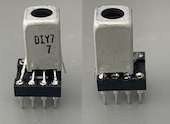

# QP-7C
## QP-7Cミニ送信機の改造（その1）

7010kHz以外の周波数での使用と多バンド化対応に向けて改造しました．  
改造は以下の2点です．  
### 1．Si5351モジュールを使用した任意周波数での出力  
	Si5351モジュール（秋月電子）を使用し，発振出力”CLK0”を68pFのコンデンサーを介してドライブ段に入力しました．  
	Si5351は，Arduino Nano互換機からI2Cインターフェースで制御．  
	秋月電子のSi5351モジュールは3.3V駆動なので，本来はI2Cバスの電圧変換(Arduino Nanoは5V)が必要ですが，アマチュア的に電流制限抵抗(10kΩ)の直列接続で使用しました．  
	周波数変更の最も単純なやり方は，Arduinoのプログラムで周波数を固定して発振させる（周波数を変えたいときはプログラムを変える）方法です．  
7010kHz送信出力は，5V(Arduino nanoからの電源供給)で約0.2W， 電源12Vで約2Wでした．  
### 2．多バンド化に向けて，ドライブ段とファイナル段の結合トランスのソケット化およびLPFのソケット化  
	トランス：8ピンICソケットの上にDIY7を乗せてハンダ付け，受け側も8ピンICソケットにします．  
		他のバンド用には、例えばFCZコイル（サトー電気）+共振コンデンサーで大丈夫でしょうか．  
	LPF：8ピン連結ソケットの上に基板を乗せ，その上にLPFを構成しました． 受け側も8ピンICソケットにしました．  
		80m帯、30m帯、20mバンド用のLPFにはCRK-10AやD4Dの回路図などを参考にしてLPFソケット上に作成可能と思われます．  
結合トランスにFCZコイル（9MHz用,サトー電気）+共振コンデンサー(62pF)を用い，CRK-10Aの10MHzモデルのLPFの回路で実験したところ，10110kHzでの送信出力は，5V(Arduino nanoからの電源供給)で約0.2W， 電源12Vで約1Wでした．  

具体的には，図のようにChocolate基板（3x2）上に作製しました．  
  

図中の赤いジャンパー線は基盤の裏側（銅箔側），黒いジャンパー線は部品側で配線です．  
太いジャンパー線(+3.3VとI2Cの配線)は，基盤の裏側で被覆線を使って接続しました．  

Arduino Nano互換機のアナログ端子側(図の下側，+3.3V, +5V, Vin端子のある側)は，Chocolate基板上にピンソケットを付けて，ピンヘッドを付けたArduino Nano互換機と接続します．  
ただし，RSTピンはピンソケットのピンを曲げるか切るかして接続しません（そのまま繋ぐとグランドに接続されてしまう）．  
デジタル端子側(図の上側, D0-D12がある側)はChocolate基板にはピンソケットを付けず，Arduino Nano互換機のピンは空中に浮かしておきます．  
（デジタル端子側のGNDピンだけは，ピンソケットを付けても良い（付けると力学的に安定化します））．  

この図の配置ですと，+5V出力ピンがChocolate基板のグランドに当たってしまうので，図の赤線に沿ってChocolate基板をコの字型にパターンカットしました．  
Arduino Nano互換機の+5V出力を使用しないのであれば，RSTピンと同様にピンソケットのピンを曲げるか切るかして接続しなければOKです．  
Si5351へ電源供給はArduino Nano互換機の+3.3V出力ピンから行います．  
Arduino Nano互換機のUSB端子から電源を受け，+5V出力ピンおよび+3.3V出力ピンへ電源出力しますので，ここからドライブ段とファイナル段への5V供給も可能です．  
Chocolate基板のグランドは全体に繋がっているので，電源の配線は＋側だけでも大丈夫でした．  
DCジャック使用時は，Arduino Nano互換機のVin端子に電源供給します．  
（ブレッドボード用ＤＣジャックＤＩＰ化キットを使って，DCジャックをChocolate基板上に配置しました．）  

Si5351の制御（I2C）にはA4ピン(SDA), A5ピン(SCL)を使用します．  

Si5351モジュール，トランス，LPF用に8ピンICソケットを付けました．  
トランスとLPFをソケット化したので，部品配置がオリジナルとは少し変わっています．  
トランスの8ピンICソケットへの取り付けは写真のようにしました．  
  
電鍵用のジャックも，基板取付用３.５ｍｍステレオミニジャックを使って，Chocolate基板上に配置しました．  

LPFはChocolate基板（1x1）上に作製できます（図を参照）．  
Chocolate基板の中途半端なカットは，カッターナイフで切り込みを入れてからラジオペンチで割れば可能です．  
銅箔側に部品を置かないと，8ピン連結ソケットの半田付けが困難でした．  
（両面ユニバーサル基板なら何の心配もありません．）
#### 最も単純なArduino Nano用スケッチは，”QP-7C_simple.ico”です．  
	"Etherkit SI5351"ライブラリーを使用しました．  
	周波数を変えたいときはプログラム中の”freq”の値を変えます．  
	発振周波数の校正は，無線機で信号を受信しながら行ってください（cal_factorを変えます）．
#### 必要追加部品(2021年10月1日時点の価格)  
	Chocolate基板：CRkits共同購入プロジェクト，380円　http://jl1kra.sakura.ne.jp/chocolate.html  
	Arduino Nano互換機：500円から1,000円程度，オリジナルは高価  
	秋月電子Si5351モジュール：秋月電子，500円　https://akizukidenshi.com/catalog/g/gK-10679/  
	8Pソケット（Si5351モジュール受け、DIY7、DIY7受け、LPFソケット受け）：秋月電子，15円x4　https://akizukidenshi.com/catalog/g/gP-00035/  
	8P連結ソケット（両端オスピン）（LPFソケット用）：秋月電子，55円　https://akizukidenshi.com/catalog/g/gP-00264/  
	ブレッドボード用ＤＣジャックＤＩＰ化キット：秋月電子，100円　https://akizukidenshi.com/catalog/g/gK-05148/  
	基板取付用３．５ｍｍステレオミニジャック：秋月電子，50円　https://akizukidenshi.com/catalog/g/gC-12478/  
	分割ロングピンソケット　１×４２（Arduino Nano受け）：秋月電子，80円　https://akizukidenshi.com/catalog/g/gC-05779/  
	ピンヘッダ　１×４０（必要に応じて）：秋月電子，35円　https://akizukidenshi.com/catalog/g/gC-00167/  
	電解コンデンサ 16V, 100μF（電源用）：2個  
	積層コンデンサ10μF(Si5351電源用）：1個  
	積層コンデンサー1 uF(Nano電源用）：1個  
	抵抗　10kΩ(Si5351モジュールI2C電圧降下用）：2個  
	
### ミニ送信機の改造（その1）の追加  
 秋月電子のI2C接続小型液晶(AQM0802A)を使用して周波数の表示を行い，タクトスイッチで周波数を変えるようにしてみました．  
   
   
	I2C信号の取り出しは，上の図の青色の位置のピンから取りました．  
	LCDとタクトスイッチはユニバーサル基板に乗せ，ピンソケットでChocolate基板と接続しました．  
	Si5351の上に基板が来る形になるので，Si5351をピンソケットタイプにした場合，高さがギリギリになりました．  
	このため，上のピンを切り詰めて，ユニバーサル基板の下に絶縁テープを貼る必要がありました．  
	Chocolate基板には，グランド，3.3V電源，I2C信号用のピンヘッダをつけておきます．  
	(ピンヘッダを長いタイプ（例えば，秋月電子の連結ピンヘッダ6/9/3）にすると高さに余裕がでます．)  
	基板には，タカチ電機工業のスルーホール基板TNF25-35がそのまま使えます．  
	タクトスイッチにはコネクタ付コードをつけておき，Arduino Nano互換機に接続しました(スイッチを押すとグランドに接続)．  
#### Arduino Nano用スケッチ例は，”QP-7C_LCD.ico”です．  
	LCDの表示には”LCD_ST7032"ライブラリーを使用しました．  
	D8ピンを変更する周波数の桁の変更に使用しました．  
	D9ピンを周波数のアップに使用しました．  
	D10ピンを周波数のダウンに使用しました．  
	バンド外の周波数は，強制的に許容バンド内に変更します．  

#### 必要追加部品(2021年10月1日時点の価格)  
	Ｉ２Ｃ接続小型ＬＣＤモジュール（８×２行）ピッチ変換キット：秋月電子，600円　https://akizukidenshi.com/catalog/g/gK-06795/  
	タクトスイッチ：秋月電子，10円x3　https://akizukidenshi.com/catalog/g/gP-03647/  
	コネクタ付コード　４Ｐ：秋月電子，80円 https://akizukidenshi.com/catalog/g/gC-15385/  
	両面ユニバーサル基板：タカチ電工のTNF25-35が便利  
	ピンソケット, ピンヘッダ（）：ミニ送信機の改造（その1）の残り  
